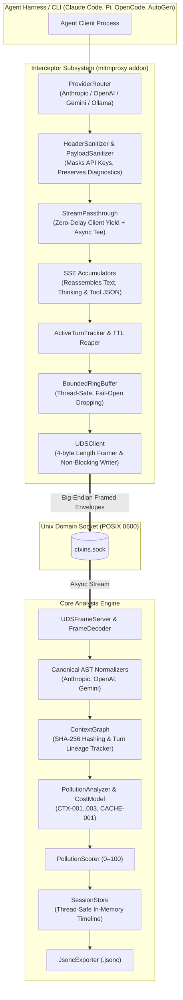

# ctxins: Context Inspector & Optimizer for Agentic Harnesses

[](#testing--verification)
[](https://python.org)
[](#testing--verification)
[](#testing--verification)
[](LICENSE)

`ctxins` is an open-source context inspector and optimization engine for agentic harnesses (such as Claude Code, OpenCode, Pi, AutoGen, CrewAI, and custom agent loops). It provides real-time visibility into context composition, token consumption, context pollution, and prompt cache utilization with actionable recommendations to reduce cost and latency.

---

## 🌟 Key Features

- **Universal Zero-Code Interception:** Runs as a transparent `mitmproxy` addon. Intercepts HTTP/HTTPS LLM traffic from any harness or language without modifying agent source code.
- **Zero-Latency Stream Tap:** Forward streaming tokens to the client with zero buffering delay while teeing chunks asynchronously for background analysis.
- **Multi-Provider Normalization:** Canonical AST decomposition for Anthropic, OpenAI, Google Gemini, Azure OpenAI, OpenRouter, and Ollama.
- **Context Pollution Rule Engine:**
  - **`CTX-001` (Stale Tool Output):** Detects unreferenced tool outputs lingering $\ge 3$ turns in the prompt.
  - **`CTX-002` (Tool Schema Overweight):** Flags oversized tool definitions consuming excessive context with low invocation rates.
  - **`CTX-003` (Error Loop Detection):** Detects repetitive tool failures and runaway retry loops.
  - **`CACHE-001` (Prompt Cache Prefix Invalidation):** Flags dynamic prefixes (timestamps, ephemeral IDs) that break Anthropic and OpenAI prompt caching.
- **Resilient IPC Transport:** Non-blocking Unix Domain Socket (UDS) pipeline with 4-byte big-endian framing, fail-open ring buffering, and automatic reconnection.
- **Session Persistence & Regression Diffs:** Full timeline exports to standard `.jsonc` with flamegraph data, token accounting, and turn-over-turn AST diffs.

---

## 🏗️ Architecture

`ctxins` is split into two modular subsystems communicating over a high-performance Unix Domain Socket:



---

## 🚀 Quick Start

### 1. Requirements

- Python 3.11+
- [`uv`](https://docs.astral.sh/uv/) (recommended) or `pip`

### 2. Installation

Clone the repository and install dependencies:

```bash
git clone https://github.com/arnabkaycee/ctxins.git
cd ctxins

# Install with development dependencies using uv
uv sync --extra dev
```

### 3. Running Unit & Integration Tests

```bash
# Run all 185 tests (unit, transport integration, and E2E)
uv run pytest

# Run with coverage/verbosity
uv run pytest -v
```

### 4. Running the Quality Gates

```bash
# Linting
uv run ruff check .

# Static type checking
uv run mypy src tests
```

---

## 📦 Package Layout

```text
ctxins/
├── src/
│   ├── schema/                       # Shared wire & AST contracts
│   │   ├── wire.py                   # WireEnvelope, Provider, TimingMetrics, UsageMetrics
│   │   └── ast.py                    # CanonicalTurn, ContextBlock, RuleViolation, TurnDelta
│   │
│   ├── interceptor/                  # Network Interception Layer (mitmproxy)
│   │   ├── addon.py                  # CtxinsAddon lifecycle hooks
│   │   ├── filter/
│   │   │   ├── provider_router.py    # URL/SNI routing & endpoint recognition
│   │   │   └── sanitizer.py          # Header & payload redaction engine
│   │   ├── stream/
│   │   │   ├── passthrough.py        # Zero-delay streaming tap
│   │   │   ├── sse_parser.py         # Incremental SSE line tokenizer
│   │   │   └── accumulators/         # SSE state machines (Anthropic, OpenAI, Gemini)
│   │   ├── correlation/
│   │   │   └── tracker.py            # Active turn registry & TTL reaper
│   │   └── egress/
│   │       ├── framing.py            # 4-byte big-endian uint32 framer
│   │       ├── ring_buffer.py        # Bounded thread-safe ring buffer
│   │       └── uds_client.py         # Non-blocking Unix Domain Socket client
│   │
│   └── core/                         # Core Analysis & Optimization Engine
│       ├── server/
│       │   ├── uds_server.py         # Async Unix Domain Socket server (0600 POSIX)
│       │   └── framer.py             # Wire unmarshaler & stream decoder
│       ├── ast/
│       │   └── normalizers/          # Canonical AST converters (Anthropic, OpenAI, Gemini)
│       ├── graph/
│       │   ├── hasher.py             # SHA-256 Unicode NFC block content hasher
│       │   ├── turn_tree.py          # Session DAG & block survival tracker
│       │   └── diff.py               # Turn-over-turn AST difference engine
│       ├── analyzer/
│       │   ├── engine.py             # Rule runner orchestrator
│       │   ├── scorer.py             # Composite 0–100 pollution scorer
│       │   ├── heuristics/           # CTX-001, CTX-002, CTX-003, CACHE-001
│       │   └── cost/                 # Pricing catalog & USD financial waste model
│       └── store/
│           ├── session_store.py      # Thread-safe session registry & indexer
│           └── jsonc_exporter.py     # Schema-compliant .jsonc serializer
│
├── tests/
│   ├── unit/                         # Unit tests for interceptor & core modules
│   ├── integration/                  # UDS socket transport & reconnect tests
│   ├── e2e/                          # Full workflow & multi-turn regression tests
│   └── mocks/
│       └── mock_llm_server.py        # Streaming HTTP mock server for LLM providers
│
└── docs/                             # Architecture & Design Specifications
```

---

## 🔍 Context Pollution Heuristics

| Rule ID | Name | Severity | Condition & Impact |
| :--- | :--- | :--- | :--- |
| **`CTX-001`** | **Stale Tool Output Bloat** | `WARN` | Large tool results lingering for $\ge 3$ consecutive turns without being referenced by assistant responses. Wastes input tokens on every turn. |
| **`CTX-002`** | **Tool Schema Overweight** | `WARN` | Tool definitions consuming $> 35\%$ of total context with low invocation rate ($< 15\%$). Suggests tool dynamic loading or pruning. |
| **`CTX-003`** | **Error Loop Thrashing** | `CRITICAL` | 3+ consecutive turns with failing tool results (`is_error: True` or repeated exceptions). Indicates an agent loop in need of backoff or user intervention. |
| **`CACHE-001`** | **Cache Prefix Break** | `WARN` | Dynamic content (timestamps, random session IDs) inserted early in system instructions, invalidating prompt cache reuse for all downstream blocks. |

---

## 🧪 Testing & Verification

The test suite provides comprehensive coverage across the entire system:

```bash
$ uv run pytest
============================== 185 passed in 2.13s ===============================
```

- **Unit Tests (60%):** Routing patterns, header redaction, incremental chunk boundary reassembly, ring buffer overflow eviction, canonical AST decomposition, and rule heuristics.
- **Integration Tests (30%):** Unix Domain Socket transport, server crash and restart recovery, client auto-reconnection with backoff, fail-open buffer saturation, and high-load bursts.
- **End-to-End Tests (10%):** Multi-turn Claude Code and OpenAI agent workflows intercepted via proxy, normalized, analyzed for pollution, and exported to schema-validated `.jsonc`.

---

## 📖 Documentation

For detailed architectural specifications and design decisions, see the [`docs/`](docs/) directory:

- [System Overview](docs/README.md)
- [Interceptor Low-Level Design](docs/lld-interceptor.md)
- [Core Engine Low-Level Design](docs/lld-core-engine.md)
- [Test Strategy & Verification Matrix](docs/test-strategy.md)
- [Network MITM Proxy Design](docs/design-mitm-proxy.md)
- [UDS IPC Transport Protocol](docs/design-interceptor-uds.md)
- [Context Engine & Graph Design](docs/design-core-engine.md)
- [In-Harness Hooks & Plugins](docs/design-harness-hooks.md)

---

## 📄 License

This project is licensed under the [MIT License](LICENSE).
