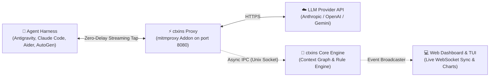

# ctxins: Context Inspector & Optimizer for Agentic Harnesses

[](docs/development.md#2-testing-suite)
[](https://python.org)
[](docs/development.md#3-quality-gates--linting)
[](docs/development.md#3-quality-gates--linting)
[](LICENSE)

`ctxins` is an open-source context inspector and optimization engine for agentic coding harnesses (Antigravity `agy`, Claude Code, Aider, OpenCode, Pi, AutoGen, CrewAI, and custom loops). It provides real-time visibility into context composition, token consumption, context pollution, and prompt cache utilization with **zero agent code modifications** and **zero token delivery delay**.

---

## ⚡ How It Works



1. **Passive Stream Tap:** Runs as a transparent `mitmproxy` addon, intercepting LLM requests and streaming tokens downstream with zero buffering delay.
2. **Context DAG & Pollution Analysis:** Ships framed telemetry over a non-blocking Unix Domain Socket to the Core Engine, tracking block lineage, prompt cache invalidations, and stale tool outputs.
3. **Automated Interceptor Lifecycle:** `ctxins run`, `ctxins web`, and `ctxins live` automatically spawn and manage `mitmdump` on the configured proxy port (default: `8080`).
4. **Fail-Open Safety:** Ring buffers bound memory to ~10MB and safely drop frames under load so your agent's work is never blocked or interrupted.

---

## 📋 Prerequisites

- **Operating System:** macOS or Linux (utilizes Unix Domain Sockets for high-throughput IPC).
- **Python:** Version **3.11+**.
- **Package Manager:** [`uv`](https://docs.astral.sh/uv/) (strongly recommended) or `pip`.

---

## 🚀 Quick Start

### Option A: One-Command Runner (`ctxins run`)
Execute your agent harness wrapped with an automatic interceptor proxy and interactive presentation UI:

```bash
git clone https://github.com/arnabkaycee/ctxins.git && cd ctxins
uv sync --extra dev

# Run with Web Dashboard (http://localhost:8484)
uv run ctxins run --web --port 8484 -- agy
uv run ctxins run --web --port 8484 -- claude

# Run with Terminal UI (TUI)
uv run ctxins run --tui -- agy
uv run ctxins run --tui -- claude
```

### Option B: Standalone Dashboard Server (`ctxins web`)
Launch the Web Dashboard and background proxy daemon attached to the Core Engine:

```bash
# Start Web Dashboard on port 8484 and proxy interceptor on port 8080
uv run ctxins web --port 8484 --proxy-port 8080

# In your agent's terminal, route traffic through ctxins:
HTTP_PROXY="http://127.0.0.1:8080" HTTPS_PROXY="http://127.0.0.1:8080" SSL_CERT_FILE="$HOME/.mitmproxy/mitmproxy-ca-cert.pem" agy

# Or using the with-ctxins helper:
with-ctxins claude
with-ctxins agy
```

> **Tip:** See [Harness Integration Guides](docs/harness-guides.md) for framework-specific proxy configuration details (Claude Code, Antigravity, Aider, AutoGen, CrewAI, etc.).

---

## 🛠️ CLI Reference

| Subcommand | Description | Key Options |
| :--- | :--- | :--- |
| `ctxins run` | Spawn proxy, launch agent harness subprocess with auto-configured environment, and open UI | `--web`, `--tui`, `--port PORT`, `--proxy-port PORT`, `--socket PATH`, `-- COMMAND...` |
| `ctxins web` | Launch real-time Web Dashboard server and auto-spawned mitmproxy interceptor | `--port PORT` (8484), `--host HOST`, `--proxy-port PORT` (8080), `--socket PATH` |
| `ctxins tui` | Launch interactive Terminal UI (Textual) attached to Core Engine | `--socket PATH`, `--proxy-port PORT` (8080) |
| `ctxins live` | Start Core Engine + selected UI mode (`web` or `tui`) | `--web`, `--tui`, `--port PORT`, `--proxy-port PORT`, `--socket PATH` |

---

## 📊 Real-Time UIs & Captured Metrics

`ctxins` provides purpose-built real-time user interfaces to monitor context dynamics, cache performance, and optimization recommendations:

### 1. Interactive Terminal UI (TUI)
Designed to run side-by-side with your agent harness in split terminals or `tmux`:
```bash
# Launch interactive TUI attached to active Core Engine
uv run ctxins tui --socket /tmp/ctxins.sock
```
```text
┌─────────────────────────────────────────────────────────────────────────────────────────────────────────┐
│ ctxins v0.1.0 │ Session: sess_01j7abc991 (claude-3-5-sonnet) │ Status: ● STREAMING (Turn #4) │ Q: Quit │
├─────────────────────────────────────────────────────────────────────────────────────────────────────────┤
│ TOTAL TOKENS: 84.2k  │ CACHE HIT: 73.6% (62.0k) │ SPEND: $0.284 │ WASTED: $0.092 │ POLLUTION: 14.2/100  │
├──────────────────────────────┬────────────────────────────────────────────┬─────────────────────────────┤
│ [1] TURNS & TIMELINE         │ [2] CONTEXT COMPOSITION (TURN #3)          │ [3] RECOMMENDATIONS & ALERTS│
├──────────────────────────────┼────────────────────────────────────────────┼─────────────────────────────┤
│ ▶ Turn #1 (init)      12.4k  │ System Prompt:   1,800 tok  [2.1%]   ■■     │ ⚠ CTX-001: Stale Tool Out   │
│   Turn #2 (file read) 24.1k  │ Tool Schemas:    2,400 tok  [2.8%]   ■■■    │   Turn #3: file_search res  │
│   Turn #3 (bash run)  48.2k  │ Conversation:    3,200 tok  [3.8%]   ■■■■   │   unreferenced for 3 turns. │
│ ● Turn #4 (streaming) 84.2k  │ Tool Results:   14,500 tok [17.2%]  ■■■■■■ │   Waste: $0.048 (14.5k tok) │
│                              │ Thinking Block:    420 tok  [0.5%]   ■      │   Fix: Prune old output     │
│                              │ Output Tokens:     350 tok  [0.4%]   ■      │ ─────────────────────────── │
│                              │ Cache Read:     62,000 tok [73.6%]  ■■■■■■ │ 🚨 CACHE-001: Prefix Break  │
│                              ├────────────────────────────────────────────┤   System prompt hash shifted│
│                              │ SELECTED BLOCK: tool_result (id: blk_90fa) │   Waste: $0.044             │
│                              │ Tool: run_shell ("find . -name '*.py'")    │   Fix: Move timestamp to end│
│                              │ Size: 14,500 tokens | Survived: 3 turns    │                             │
├──────────────────────────────┴────────────────────────────────────────────┴─────────────────────────────┤
│ [Tab] Switch Pane  [↑/↓] Navigate Turns  [Enter] Inspect Block  [r] Filter Warnings  [e] Export .jsonc  │
└─────────────────────────────────────────────────────────────────────────────────────────────────────────┘
```
👉 *See [docs/design-ui-dashboards.md](docs/design-ui-dashboards.md#4-interactive-terminal-ui-tui-design) and [docs/lld-presentation.md](docs/lld-presentation.md#3-terminal-ui-tui-architecture) for complete TUI design and implementation specifications.*

### 2. Live Web Dashboard & Formatted JSON Inspector
Launch the local web dashboard to view interactive token charts, cache invalidation heatmaps, and recommendation details:
```bash
# Start the web dashboard gateway (default: http://localhost:8484)
uv run ctxins web --port 8484 --proxy-port 8080
```
- **Real-Time WebSocket Streaming (`/ws/live`)**: Instant session discovery, streaming status updates, and turn completion without page refreshes.
- **Token Composition & Cache Hit Rate Graphs**: Interactive stacked bar charts showing exact system, tool definition, conversation history, tool result, thinking, and output token distributions per turn.
- **Interactive, Collapsible JSON Inspector**:
  - **Hierarchical Node Folding**: Expand/collapse objects and arrays with visual carets (`▼`/`▶`).
  - **Collapsed Summary Pills**: Displays compact item/key counts (e.g. `{ 8 keys }`, `[ 12 items ]`) when folded.
  - **Syntax Coloring**: Syntax-highlighted keys, strings, numbers, booleans, and nulls.
  - **Global Controls**: Instant "Expand All" and "Collapse All" for complex multi-thousand token contexts.
  - **Live Filter & Search**: Search keys or values in real time with keyword highlighting (`<mark>`) and automatic ancestor expansion.
  - **Raw / Tree View Toggle & One-Click Copy**: Switch between interactive tree and raw formatted JSON with one-click clipboard copying.
- **Prescriptive Recommendation Cards**: One-click remediation snippets and financial waste estimates for `CTX-001`..`004` and `CACHE-001`.
- **Turn-to-Turn AST Diffing**: Inspect newly injected, persisted, and pruned context blocks between any two turns in a session.

👉 *See [docs/design-ui-dashboards.md](docs/design-ui-dashboards.md#5-web-dashboard-design) and [docs/lld-presentation.md](docs/lld-presentation.md#4-web-dashboard-server--restwebsocket-apis) for complete web architecture.*

### 3. Session Timeline Exports (`.jsonc`)
The Core Engine exports complete session timelines into annotated `.jsonc` files (conforming to `https://ctxins.dev/schemas/session.v1.json`). Exports contain:
- Turn-by-turn token consumption (input, output, cache creation, cache read).
- Time-To-First-Token (TTFT) and stream durations.
- AST diffs showing added, persisted, and pruned context blocks.
- Triggered rule violations (`CTX-001`..`004`, `CACHE-001`), severity ratings, and estimated USD waste.

### 4. Low-Level Network Inspection (`mitmweb` / `mitmproxy`)
For raw HTTP/2 and SSE chunk debugging, `ctxins` supports mitmproxy's native frontends:
```bash
# Web proxy inspector (http://127.0.0.1:8081)
uv run mitmweb -p 8080 -s src/interceptor/addon.py

# Terminal proxy inspector
uv run mitmproxy -p 8080 -s src/interceptor/addon.py
```

---

## 🔌 Supported Harnesses

| Harness | Guide | Key Capabilities Inspected |
| :--- | :--- | :--- |
| **Claude Code** | [Setup Guide](docs/harness-guides.md#a-claude-code-claude) | Prompt caching hits, thinking blocks, stale `view_file` results |
| **Antigravity (`agy`)** | [Setup Guide](docs/harness-guides.md#b-antigravity-cli-agy) | Gemini SSE streams, multi-turn tool outputs, sub-agent context bloat |
| **Aider** | [Setup Guide](docs/harness-guides.md#c-aider-aider) | Multi-turn file contexts, repo-map overhead, token consumption |
| **OpenCode** | [Setup Guide](docs/harness-guides.md#d-opencode-opencode) | Workspace `.env` proxying, multi-turn diffs |
| **Pi** | [Setup Guide](docs/harness-guides.md#e-pi-pi) | Proxy mode or zero-proxy in-process telemetry hook |
| **AutoGen / AG2** | [Setup Guide](docs/harness-guides.md#f-autogen--ag2-python) | Multi-agent conversation snowballing and unused tool schemas |
| **CrewAI** | [Setup Guide](docs/harness-guides.md#g-crewai-python) | Task output accumulation across sequential and hierarchical crews |
| **LangChain / LangGraph** | [Setup Guide](docs/harness-guides.md#h-langchain--langgraph-python--typescript) | Agent state graph turn lineage and tool retry loops |
| **Custom Loops & SDKs** | [Setup Guide](docs/harness-guides.md#i-custom-agent-loops--raw-sdks) | Python (`anthropic`, `openai`), TypeScript, cURL, and Docker recipes |

---

## 🔍 Context Pollution Heuristics

`ctxins` runs algorithmic heuristics against the session DAG to quantify token waste and calculate financial savings:

- **`CTX-001` (Stale Tool Output Bloat):** Flags unreferenced tool results lingering $\ge 3$ consecutive turns.
- **`CTX-002` (Tool Schema Overweight):** Flags tool schemas consuming $> 35\%$ of context with $< 15\%$ invocation rate.
- **`CTX-003` (Error Loop Thrashing):** Detects $3+$ consecutive turns repeating failing tool executions.
- **`CACHE-001` (Dynamic Prefix Invalidation):** Flags prefix mutations in system prompts breaking prompt cache reuse.

👉 **See [docs/heuristics.md](docs/heuristics.md) for complete mathematical formulas, threshold configurations, and suggested fixes.**

---

## 📚 Documentation & Development

- 💻 **[Development, Testing & Contribution Guide](docs/development.md)**: Running test suites (`pytest`), linters (`ruff`, `mypy`), and contributing.
- 🚀 **[Harness Integration Guides](docs/harness-guides.md)**: Detailed recipes for every agent framework.
- 🔍 **[Heuristics & Pollution Catalog](docs/heuristics.md)**: Rule catalog and composite pollution scoring math.
- 🏗️ **[Detailed Architecture & LLDs](docs/README.md)**: Low-level specifications for Interceptor, Core Engine, and IPC protocol.

---

## 📄 License

This project is licensed under the [MIT License](LICENSE).
