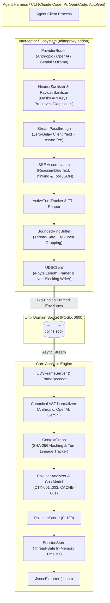

# ctxins: Context Inspector & Optimizer for Agentic Harnesses

[](#testing--verification)
[](https://python.org)
[](#testing--verification)
[](#testing--verification)
[](LICENSE)

`ctxins` is an open-source context inspector and optimization engine for agentic coding harnesses. It provides real-time visibility into context composition, token consumption, context pollution, and prompt cache utilization with actionable recommendations to reduce cost and latency.

---

## 🌟 Why ctxins?

Autonomous coding agents silently burn tokens and degrade reasoning performance over long multi-turn sessions due to:
- **Stale Tool Results:** Multi-thousand-token file reads or grep outputs that remain in conversation history turns after they were useful.
- **Overweight Tool Schemas:** Dozens of rich tool definitions consuming 30–50% of the prompt context while remaining largely uncalled.
- **Broken Prompt Caching:** Ephemeral timestamps or IDs injected early in system prompts, invalidating 90% cost-saving prompt caches.
- **Runaway Error Loops:** Models repeatedly failing commands and retrying without intervention.

`ctxins` passively intercepts agent traffic with **zero code modifications** and **zero token delivery delay**, flags pollution in real time, and exports comprehensive session flamegraphs.

---

## 🏗️ Architecture



---

## 🚀 Using with Agentic Harnesses

`ctxins` works universally with any tool, script, or language runtime. Use the `ctxins run` wrapper to automatically inject local proxy settings and certificates into your agent process:

```bash
# Wrap any agent command
ctxins run -- <your-agent-command>
```

| Harness / Tool | Runtime | Quick Command | Setup Guide |
| :--- | :--- | :--- | :--- |
| **Claude Code** | Node.js | `ctxins run -- claude` | [Claude Code Guide](docs/harness-guides.md#1-claude-code-claude) |
| **Aider** | Python | `ctxins run -- aider` | [Aider Guide](docs/harness-guides.md#2-aider-aider) |
| **OpenCode** | Node.js | `ctxins run -- opencode` | [OpenCode Guide](docs/harness-guides.md#3-opencode-opencode) |
| **Pi** | Node / TypeScript | `ctxins run -- pi` | [Pi Guide](docs/harness-guides.md#4-pi-pi) |
| **AutoGen / AG2** | Python | `ctxins run -- python agent.py` | [AutoGen Guide](docs/harness-guides.md#5-autogen--ag2-python) |
| **CrewAI** | Python | `ctxins run -- python crew.py` | [CrewAI Guide](docs/harness-guides.md#6-crewai-python) |
| **LangChain / LangGraph** | Python / TS | `ctxins run -- python agent.py` | [LangChain Guide](docs/harness-guides.md#7-langchain--langgraph-python--typescript) |
| **Custom Loops / SDKs** | Any | `ctxins run -- <cmd>` | [SDKs & Docker Guide](docs/harness-guides.md#8-custom-agent-loops--raw-sdks) |

👉 **For manual shell environment setup, in-harness native hooks, or Docker containers, see [docs/harness-guides.md](docs/harness-guides.md).**

---

## ⚡ Quick Start

### 1. Installation

Requires Python 3.11+. Install dependencies using [`uv`](https://docs.astral.sh/uv/) (recommended) or `pip`:

```bash
git clone https://github.com/arnabkaycee/ctxins.git
cd ctxins

# Install with development dependencies
uv sync --extra dev
```

### 2. Run Verification Suite

```bash
# Run all 185 unit, transport integration, and E2E workflow tests
uv run pytest

# Run linting and typecheck
uv run ruff check .
uv run mypy src tests
```

---

## 🔍 Context Pollution Heuristics

`ctxins` runs algorithmic checks against a session DAG to flag context pollution and calculate financial waste:

- **`CTX-001` (Stale Tool Output Bloat):** Flags unreferenced tool results lingering $\ge 3$ consecutive turns.
- **`CTX-002` (Tool Schema Overweight):** Flags tool schemas consuming $> 35\%$ of context with $< 15\%$ invocation rate.
- **`CTX-003` (Error Loop Thrashing):** Detects $3+$ consecutive turns repeating failing tool execution.
- **`CACHE-001` (Dynamic Prefix Invalidation):** Flags prefix mutations in system instructions breaking prompt caching.

👉 **For complete algorithm formulas, scoring math, and fixes, see [docs/heuristics.md](docs/heuristics.md).**

---

## 📖 Documentation Index

| Guide | Description |
| :--- | :--- |
| 🚀 **[Harness Integration Guides](docs/harness-guides.md)** | Step-by-step instructions for Claude Code, Aider, OpenCode, Pi, AutoGen, CrewAI, and custom SDKs. |
| 🔍 **[Context Pollution Catalog](docs/heuristics.md)** | Detailed specification of heuristic rules (`CTX-001`..`004`, `CACHE-001`) and composite scoring. |
| 🌐 **[Network Interception (MITM Proxy)](docs/design-mitm-proxy.md)** | Transparent TLS proxy design, automated CA certificate handling, and routing rules. |
| 🔌 **[In-Harness Hooks & Plugins](docs/design-harness-hooks.md)** | Zero-proxy native plugin architecture for sandboxed and containerized environments. |
| 📡 **[Interceptor & UDS Protocol](docs/design-interceptor-uds.md)** | Streaming tap architecture, 4-byte big-endian framing, and fail-open ring buffers. |
| 🧠 **[Core Analysis Engine](docs/design-core-engine.md)** | Canonical AST, context graph DAG, and `.jsonc` session export specification. |
| 🛠️ **[Interceptor Low-Level Design (LLD)](docs/lld-interceptor.md)** | Package layout, data structures, and streaming accumulator state machines. |
| ⚙️ **[Core Engine Low-Level Design (LLD)](docs/lld-core-engine.md)** | Server receiver, normalizers, heuristics, and in-memory session store implementation. |
| 🧪 **[Comprehensive Test Strategy](docs/test-strategy.md)** | Unit, integration, and E2E testing framework, mock LLM servers, and performance benchmarks. |

---

## 📄 License

This project is licensed under the [MIT License](LICENSE).
