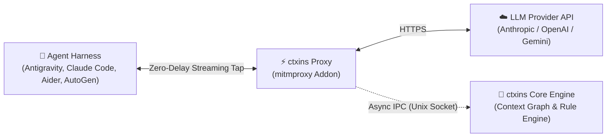

# ctxins: Context Inspector & Optimizer for Agentic Harnesses

[](docs/development.md#2-testing-suite)
[](https://python.org)
[](docs/development.md#3-quality-gates--linting)
[](docs/development.md#3-quality-gates--linting)
[](LICENSE)

`ctxins` is an open-source context inspector and optimization engine for agentic coding harnesses (Antigravity `agy`, Claude Code, Aider, OpenCode, Pi, AutoGen, CrewAI, and custom loops). It provides real-time visibility into context composition, token consumption, context pollution, and prompt cache utilization with **zero agent code modifications** and **zero token delivery delay**.

---

## ⚡ How It Works



1. **Passive Stream Tap:** Runs as a transparent `mitmproxy` addon, intercepting LLM requests and streaming tokens downstream with zero buffering delay.
2. **Context DAG & Pollution Analysis:** Ships framed telemetry over a non-blocking Unix Domain Socket to the Core Engine, tracking block lineage, prompt cache invalidations, and stale tool outputs.
3. **Fail-Open Safety:** Ring buffers bound memory to ~10MB and safely drop frames under load so your agent's work is never blocked or interrupted.

---

## 📋 Prerequisites

- **Operating System:** macOS or Linux (utilizes Unix Domain Sockets for high-throughput IPC).
- **Python:** Version **3.11+**.
- **Package Manager:** [`uv`](https://docs.astral.sh/uv/) (strongly recommended) or `pip`.

---

## 🚀 Quick Start

### 1. Start the Core Engine & Proxy
Install dependencies and launch the interceptor pipeline:

```bash
git clone https://github.com/arnabkaycee/ctxins.git && cd ctxins
uv sync --extra dev

# 1. Start the Core Frame Server (in background)
CTXINS_SOCKET_PATH=/tmp/ctxins.sock uv run python -m src.core.server.uds_server &

# 2. Start the Interceptor Proxy (headless or with web/TUI dashboard)
CTXINS_SOCKET_PATH=/tmp/ctxins.sock uv run mitmdump -p 8080 -s src/interceptor/addon.py
```

### 2. Run Any Agent Harness
Execute your agent with standard proxy environment variables or using the [`with-ctxins` helper](docs/harness-guides.md#2-universal-helper-function-with-ctxins):

```bash
# Antigravity (agy)
with-ctxins agy

# Claude Code
with-ctxins claude

# Aider
with-ctxins aider
```

> **Tip:** You can also pass environment variables inline, e.g. `HTTP_PROXY="http://127.0.0.1:8080" HTTPS_PROXY="http://127.0.0.1:8080" SSL_CERT_FILE="$HOME/.mitmproxy/mitmproxy-ca-cert.pem" agy`. See [Harness Integration Guides](docs/harness-guides.md) for harness-specific details.

---

## 📊 Viewing Captured Metrics

`ctxins` provides several ways to inspect intercepted traffic and analysis:

### 1. Web Browser Dashboard (`mitmweb`)
Launch the proxy with the embedded web interface:
```bash
CTXINS_SOCKET_PATH=/tmp/ctxins.sock uv run mitmweb -p 8080 -s src/interceptor/addon.py
```
Open **`http://127.0.0.1:8081`** in your browser to inspect real-time message streams, TTFT latency, request/response headers, and raw SSE deltas.

### 2. Interactive Terminal UI (`mitmproxy`)
Launch the interactive terminal console to inspect live flows:
```bash
CTXINS_SOCKET_PATH=/tmp/ctxins.sock uv run mitmproxy -p 8080 -s src/interceptor/addon.py
```
Use keyboard shortcuts (`Enter` to inspect flow, `Tab` to switch request/response tabs, `q` to return).

### 3. Session Timeline Exports (`.jsonc`)
The Core Engine exports complete session timelines into annotated `.jsonc` files (conforming to `https://ctxins.dev/schemas/session.v1.json`). Exports contain:
- Turn-by-turn token consumption (input, output, cache creation, cache read).
- Time-To-First-Token (TTFT) and stream durations.
- AST diffs showing added, persisted, and pruned context blocks.
- Triggered rule violations (`CTX-001`..`004`, `CACHE-001`), severity ratings, and estimated USD waste.

### 4. Real-Time Terminal Telemetry (`mitmdump`)
The default headless mode (`mitmdump`) streams real-time status lines to stdout:
```text
[INFO] REQUEST_INITIATED | corr_01j7... | provider=anthropic model=claude-3-5-sonnet
[INFO] TURN_COMPLETED    | corr_01j7... | tokens=14,200 (cache_read: 8,400) duration=840ms
```

---

## 🔌 Supported Harnesses

| Harness | Guide | Key Capabilities Inspected |
| :--- | :--- | :--- |
| **Claude Code** | [Setup Guide](docs/harness-guides.md#a-claude-code-claude) | Prompt caching hits, thinking blocks, stale `view_file` results |
| **Antigravity (`agy`)** | [Setup Guide](docs/harness-guides.md#b-antigravity-cli-agy) | Gemini SSE streams, multi-turn tool outputs, sub-agent context bloat |
| **Aider** | [Setup Guide](docs/harness-guides.md#c-aider-aider) | Multi-turn file contexts, repo-map overhead, token consumption |
| **OpenCode** | [Setup Guide](docs/harness-guides.md#d-opencode-opencode) | Workspace `.env` proxying, multi-turn diffs |
| **Pi** | [Setup Guide](docs/harness-guides.md#e-pi-pi) | Proxy mode or zero-proxy in-process telemetry hook |
| **AutoGen / AG2** | [Setup Guide](docs/harness-guides.md#f-autogen--ag2-python) | Multi-agent conversation snowballing and unused tool schemas |
| **CrewAI** | [Setup Guide](docs/harness-guides.md#g-crewai-python) | Task output accumulation across sequential and hierarchical crews |
| **LangChain / LangGraph** | [Setup Guide](docs/harness-guides.md#h-langchain--langgraph-python--typescript) | Agent state graph turn lineage and tool retry loops |
| **Custom Loops & SDKs** | [Setup Guide](docs/harness-guides.md#i-custom-agent-loops--raw-sdks) | Python (`anthropic`, `openai`), TypeScript, cURL, and Docker recipes |

---

## 🔍 Context Pollution Heuristics

`ctxins` runs algorithmic heuristics against the session DAG to quantify token waste and calculate financial savings:

- **`CTX-001` (Stale Tool Output Bloat):** Flags unreferenced tool results lingering $\ge 3$ consecutive turns.
- **`CTX-002` (Tool Schema Overweight):** Flags tool schemas consuming $> 35\%$ of context with $< 15\%$ invocation rate.
- **`CTX-003` (Error Loop Thrashing):** Detects $3+$ consecutive turns repeating failing tool executions.
- **`CACHE-001` (Dynamic Prefix Invalidation):** Flags prefix mutations in system prompts breaking prompt cache reuse.

👉 **See [docs/heuristics.md](docs/heuristics.md) for complete mathematical formulas, threshold configurations, and suggested fixes.**

---

## 📚 Documentation & Development

- 💻 **[Development, Testing & Contribution Guide](docs/development.md)**: Running test suites (`pytest`), linters (`ruff`, `mypy`), and contributing.
- 🚀 **[Harness Integration Guides](docs/harness-guides.md)**: Detailed recipes for every agent framework.
- 🔍 **[Heuristics & Pollution Catalog](docs/heuristics.md)**: Rule catalog and composite pollution scoring math.
- 🏗️ **[Detailed Architecture & LLDs](docs/README.md)**: Low-level specifications for Interceptor, Core Engine, and IPC protocol.

---

## 📄 License

This project is licensed under the [MIT License](LICENSE).
