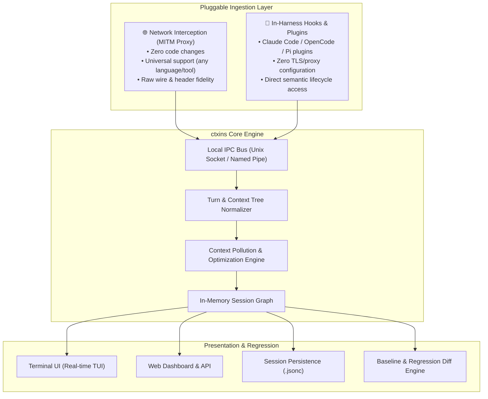

# ctxins: Context Inspector & Optimizer for Agentic Harnesses

`ctxins` is a context inspector and optimization engine for agentic harnesses (such as Claude Code, Pi, OpenCode, AutoGen, CrewAI, and custom agent loops). It provides real-time visibility into context composition, token consumption, context pollution, and prompt cache utilization with actionable recommendations to reduce cost and latency.

---

## Architecture Overview

`ctxins` is built around a **Pluggable Ingestion Pipeline** paired with a unified **Context Analysis & Optimization Engine**:



---

## Detailed Design Documentation

The architecture is documented across the following specifications:

| Specification | Description |
| :--- | :--- |
| 🚀 **[Harness Integration Guides](harness-guides.md)** | Step-by-step instructions for Claude Code, Aider, OpenCode, Pi, AutoGen, CrewAI, LangChain/LangGraph, and custom loops. |
| 🔍 **[Context Pollution & Heuristics Catalog](heuristics.md)** | Detailed specification of `CTX-001`..`004`, `CACHE-001`, detection formulas, and composite pollution score (0–100). |
| 🌐 **[Network-Level Interception (MITM Proxy)](design-mitm-proxy.md)** | Transparent TLS proxy design using mitmproxy, automated cert provisioning, route filtering, and wrapper execution. |
| 🔌 **[In-Harness Hooks & Plugins](design-harness-hooks.md)** | Native plugin architecture for Claude Code, OpenCode, Pi, and SDK callbacks (LangChain/AI SDK) for zero-proxy environments. |
| 📡 **[Interceptor Component & UDS IPC Protocol](design-interceptor-uds.md)** | High-level deep dive on the zero-latency streaming tap, length-prefixed framing over Unix Domain Sockets, and wire event contracts. |
| 🧠 **[Core Analysis Engine & Session Spec](design-core-engine.md)** | High-level architecture of context AST, pollution heuristics (`CTX-001` to `CACHE-003`), `.jsonc` schema, and baseline diffing. |
| 🛠️ **[Interceptor Low-Level Design (LLD)](lld-interceptor.md)** | Concrete package layout, data structures, SSE stream parsers (`AnthropicAccumulator`), ring buffer, and non-blocking UDS client implementation. |
| ⚙️ **[Core Engine Low-Level Design (LLD)](lld-core-engine.md)** | Concrete AST classes (`CanonicalTurn`, `ContextBlock`), async `UDSFrameServer`, algorithmic heuristic implementations (`CTX-001` to `CTX-003`, `CACHE-001`), and session store. |
| 🖥️ **[Real-Time TUI & Web Dashboard Design](design-ui-dashboards.md)** | High-level architecture, user experience, wireframes, real-time WebSocket protocol, and optimization recommendation UX for TUI & Web dashboard. |
| 📊 **[Presentation Layer Low-Level Design (LLD)](lld-presentation.md)** | Concrete class design for `PresentationBroadcaster`, Textual TUI widgets, and FastAPI / Starlette WebSocket & REST APIs. |
| 🧪 **[Comprehensive Test Strategy](test-strategy.md)** | Unit, integration, and E2E testing framework, mock upstream LLM servers, UDS transport resilience, and performance latency benchmarks. |
| 💻 **[Development & Testing Guide](development.md)** | Local environment setup, test runners, linters, project structure, and contribution workflow. |

---

## Approach Comparison: MITM Proxy vs. In-Harness Hooks

| Feature | 🌐 Network Interception (MITM Proxy) | 🔌 In-Harness Hooks & Plugins |
| :--- | :--- | :--- |
| **Setup Complexity** | Zero code changes; uses standard `HTTP_PROXY` and local CA certs. | Zero network/TLS configuration; requires installing a harness hook/plugin. |
| **Tool Compatibility** | **100% universal** (Claude Code, Pi, OpenCode, AutoGen, custom scripts, cURL). | Specific to supported harnesses (Claude Code, OpenCode, Pi, SDK callbacks). |
| **Payload Fidelity** | Exact wire bytes, raw provider headers, and raw SSE chunk intervals. | High-level message objects and metrics exposed by harness hook APIs. |
| **Semantic Context** | Inferred from prompt messages and provider responses. | Direct access to internal harness state (phases, tool metadata, user intent). |
| **Resilience** | High (independent of internal harness refactors). | Dependent on harness plugin API stability. |

---

## Key Workflows

### 1. Universal Proxy Run (Any Agent / CLI)
```bash
# Run any agent tool wrapped with automatic proxy & TUI
ctxins run -- claude
ctxins run -- npm run agent
```

### 2. Native Hook Listener (Claude Code / OpenCode / Pi)
```bash
# Start ctxins listener in TUI mode
ctxins live

# In another terminal, run Claude Code with the ctxins plugin
claude --plugin @ctxins/claude-hook
```

### 3. Baseline & Prompt Regression Testing
```bash
# Diff two runs to track token bloat, cache hit ratio, and cost
ctxins diff sessions/baseline.jsonc sessions/current.jsonc
```
