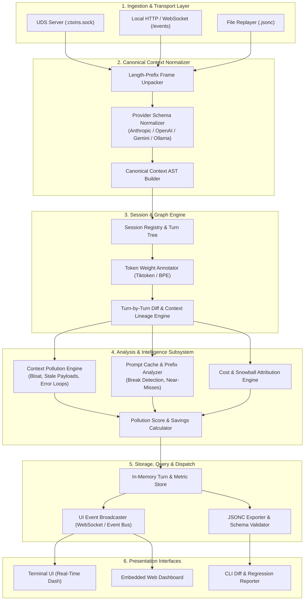
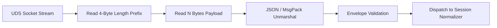
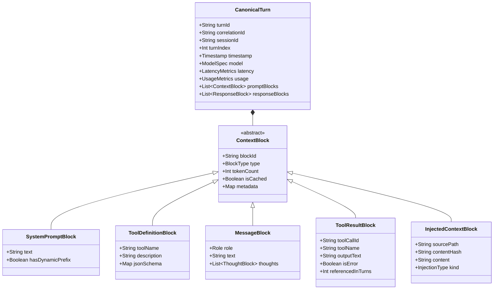
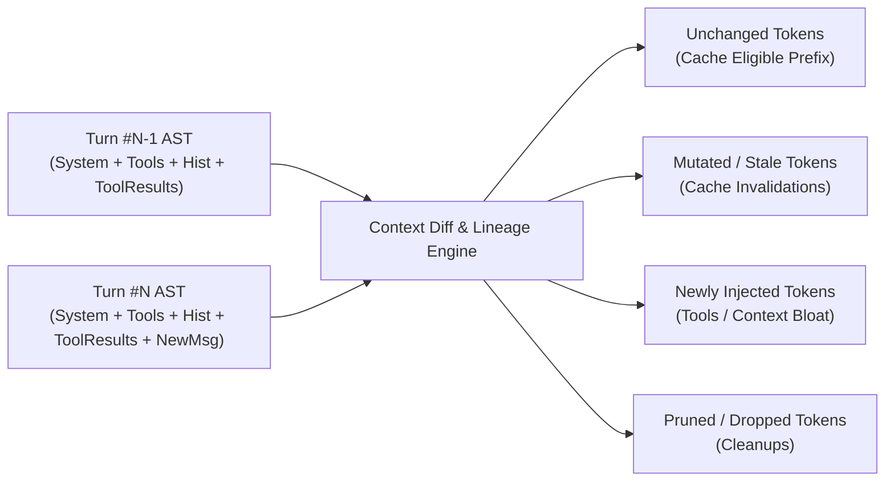
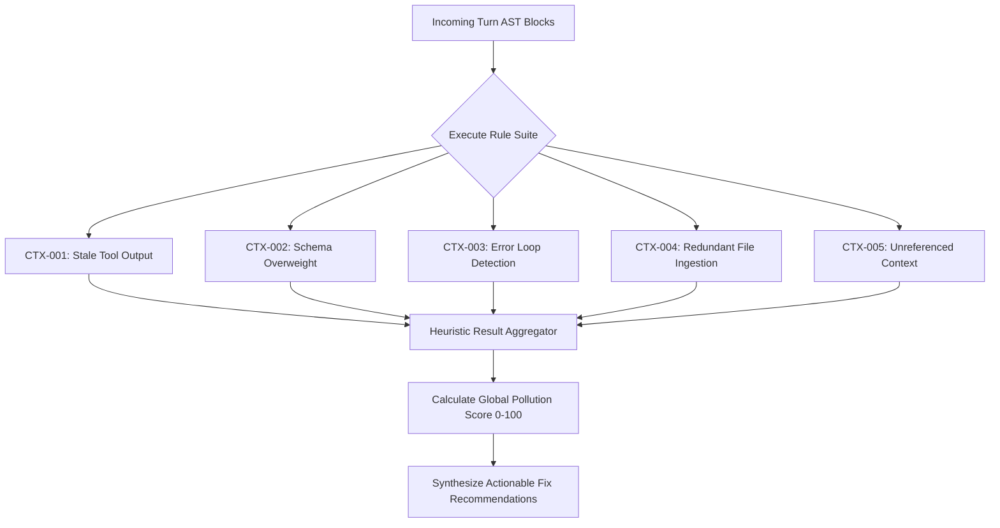

# Design: Core Analysis Engine & Session Specification

## 1. Overview & System Topology

The **`ctxins` Core Engine** is the central processing and intelligence hub. It is ingestion-agnostic, receiving raw wire events from the [MITM Proxy Layer](design-mitm-proxy.md), structured events from [In-Harness Hooks](design-harness-hooks.md), or replaying historical session files.

The engine transforms unstructured or provider-specific LLM interactions into a **Canonical Context AST**, executes deterministic **Context Pollution & Caching Heuristics**, calculates granular token and cost attributions, and exposes real-time state to terminal TUIs, embedded dashboards, and CI regression runners.



---

## 2. Component 1: Ingestion & IPC Server (`IPCServer`)

The `IPCServer` handles transport-level connection multiplexing, unmarshals wire payloads, and dispatches frames to the normalizer.



### Technical Specification:
* **Transport Modes**:
  * Primary: Unix Domain Socket at `$XDG_RUNTIME_DIR/ctxins/ctxins.sock` (permissions `0600`).
  * Secondary (Docker / Remote): Local loopback TCP/HTTP `127.0.0.1:8942/api/v1/events`.
* **Multiplexing**:
  * Tracks multiple concurrent agent sessions concurrently (e.g. multiple CLI runs or subagents).
  * Enforces backpressure: If the analysis queue exceeds 5,000 turns, logs an internal warning and prioritizes metric accumulation.
* **Connection Lifecycle**:
  * Handles graceful client disconnects, socket EOF, and heartbeat pings (`PING`/`PONG`).

---

## 3. Component 2: Canonical Context Normalizer (`TurnNormalizer`)

Every LLM provider structures prompts, tool schemas, and messages differently. The normalizer abstracts provider variances into a **Canonical Context AST (Abstract Syntax Tree)**.



### Provider Mapping Table:

| Canonical Element | Anthropic API Mapping | OpenAI API Mapping | Gemini API Mapping |
| :--- | :--- | :--- | :--- |
| **System Instructions** | `system` (string or array) | `messages[role=developer/system]` | `systemInstruction.parts[].text` |
| **Tool Definitions** | `tools[]` (`name`, `input_schema`) | `tools[type=function]` (`name`, `parameters`) | `tools[].functionDeclarations[]` |
| **User Inputs** | `messages[role=user]` | `messages[role=user]` | `contents[role=user].parts[]` |
| **Assistant Output** | `content[type=text]` | `choices[0].message.content` | `candidates[0].content.parts[].text` |
| **Model Thinking** | `content[type=thinking].thinking` | `choices[0].message.reasoning_content` | `parts[].thought` |
| **Tool Invocations** | `content[type=tool_use]` | `choices[0].message.tool_calls` | `parts[].functionCall` |
| **Tool Observations** | `messages[role=user].content[type=tool_result]` | `messages[role=tool]` | `contents[role=function].parts[].functionResponse` |
| **Cache Metrics** | `cache_creation_input_tokens`, `cache_read_input_tokens` | `prompt_tokens_details.cached_tokens` | `usageMetadata.cachedContentTokenCount` |

---

## 4. Component 3: Session & Graph Engine (`ContextGraph`)

The `ContextGraph` manages the chronological lineage of turns, computes token allocations, and performs tree diffing between successive LLM invocations.



### Diff & Lineage Capabilities:
1. **Block Hashing**:
   Each AST block is assigned a content hash (SHA-256 truncated to 64 bits). Two identical system prompts or tool schemas across turns produce identical hashes, enabling $O(1)$ equality checks.
2. **Context Retention & Survival Rate**:
   Tracks how many turns a specific block survives in memory. If a 10,000-token tool output was added at Turn 2, the engine tracks its presence through Turns 3, 4, 5...
3. **Compound Growth Rate (Context Snowball)**:
   Measures context amplification turn-over-turn:
   $$\text{Compounding Factor } C_t = \frac{\text{Total Input Tokens}_t - \text{Newly Injected User Tokens}_t}{\text{Total Input Tokens}_{t-1}}$$
   A compounding factor $\ge 1.0$ indicates that the context is growing monotonically without pruning.

---

## 5. Component 4: Context Pollution Analyzer (`PollutionAnalyzer`)

The `PollutionAnalyzer` runs a suite of deterministic detection algorithms against the `ContextGraph` to identify token waste, loops, and bloat.



### Detailed Detection Algorithms

#### A. `CTX-001`: Stale Tool Output Bloat
* **Trigger Condition**:
  A `ToolResultBlock` with $\text{token\_count} \ge 3,000$ remains present in the conversational context for $\ge 3$ consecutive turns following its generation, with zero occurrences of its output keywords or JSON keys referenced in subsequent assistant responses.
* **Severity**: `HIGH`
* **Suggested Fix**: "Prune or summarize `view_file` / tool output after 2 conversational turns."

#### B. `CTX-002`: Tool Schema Overweight & Dead Tools
* **Trigger Condition**:
  $$\frac{\sum \text{Tokens}(\text{ToolDefinitions})}{\text{Total Input Tokens}} > 0.35 \quad \text{AND} \quad \frac{\text{Tools Invoked in Session}}{\text{Total Registered Tools}} < 0.15$$
* **Severity**: `MEDIUM`
* **Suggested Fix**: "Only 2 of 24 tools were invoked. Use dynamic tool filtering or partition tools across specialized subagents."

#### C. `CTX-003`: Repetitive Error Loops & Agent Thrashing
* **Trigger Condition**:
  The last $K \ge 3$ consecutive turns contain `ToolResultBlock` where `isError == true`, and the normalized string distance (Levenshtein similarity) between error messages $> 0.85$.
* **Severity**: `CRITICAL`
* **Suggested Fix**: "Agent stuck in error retry loop on tool `execute_bash`. Inject circuit breaker or corrective system steering."

#### D. `CTX-004`: Redundant File Ingestion
* **Trigger Condition**:
  Two or more `InjectedContextBlock` entries share the identical content hash (`contentHash`), or have an edit distance $< 5\%$ across turns while consuming $> 2,000$ tokens per turn.
* **Severity**: `HIGH`
* **Suggested Fix**: "File `src/parser.ts` was re-injected in full across 4 turns. Transmit incremental line diffs rather than full file dumps."

---

## 6. Component 5: Prompt Caching & Cost Engine (`CacheAndCostEngine`)

This subsystem calculates exact costs and detects missed savings opportunities from broken prompt caching.

### A. Cache Prefix Analysis (`CACHE-001` to `CACHE-003`)
Prompt caching (Anthropic prompt caching, OpenAI cached tokens) depends strictly on exact byte-for-byte prefix matching:

```text
Turn 1: [System Prompt (Static)] [Tool Definitions] [User Message 1]
         ▲ Cache Written (1,800 Tokens)

Turn 2: [TIMESTAMP: 12:01:05] [System Prompt] [Tool Definitions] [User Message 1] [Msg 2]
         ▲ CACHE BROKEN! Dynamic timestamp invalidated the entire prefix.
```

* **Dynamic Prefix Detection**: Flags volatile keys (e.g. `Current time: ...`, `Session UUID: ...`) positioned before static instructions.
* **Tool Schema Order Instability**: Flags when the order of tool definitions fluctuates across turns.
* **Cache Threshold Near-Miss**: Flags when a prompt contains 920 tokens (where the provider caching minimum is 1,024 tokens).

### B. Financial Modeling & Savings Calculation
* **Cost Equation**:
  $$\text{Cost} = (T_{\text{in}} - T_{\text{cache\_read}}) \cdot P_{\text{in}} + T_{\text{cache\_read}} \cdot P_{\text{cache\_read}} + T_{\text{cache\_write}} \cdot P_{\text{cache\_write}} + T_{\text{out}} \cdot P_{\text{out}}$$
* **Wasted Spend Calculation**:
  Identifies dollar amounts attributable directly to stale tool outputs and broken cache prefixes.

---

## 7. Component 6: In-Memory Session Store & Query Engine (`SessionStore`)

* **Storage Engine**: High-performance, thread-safe in-memory ring buffer storing the last $N$ active sessions (default: 100 sessions / ~100MB).
* **Indexing**:
  * By `sessionId`
  * By `model`
  * By `ruleViolation` (`CTX-001`, `CACHE-001`, etc.)
* **Query API**:
  * `getSession(id)` $\to$ Canonical session representation.
  * `getTimeline(id)` $\to$ Turn-by-turn token flamegraph data.
  * `getViolations(id)` $\to$ Filtered list of flags and potential savings.

---

## 8. Component 7: Presentation Dispatcher & Session Format (`.jsonc`)

The presentation layer consumes data from the `SessionStore` and broadcasts updates via:
1. **Interactive Terminal UI (TUI)**: Real-time multi-pane dashboard rendered via `textual` or `ratatui`.
2. **WebSocket Stream (`/ws/session`)**: Live events pushed to local embedded web dashboards.
3. **Canonical Session Serialization (`.jsonc`)**: Fully portable, annotated session files.

### Canonical `.jsonc` Schema Definition

```jsonc
{
  "$schema": "https://ctxins.dev/schemas/session.v1.json",
  "sessionId": "sess_01j7abc991",
  "version": "1.0",
  "timestamp": "2026-09-04T12:00:00Z",
  "client": {
    "harness": "claude-code",
    "version": "1.0.4",
    "source": "uds-interceptor"
  },
  "model": {
    "provider": "anthropic",
    "name": "claude-3-5-sonnet-20241022"
  },
  "summary": {
    "totalTurns": 6,
    "totalInputTokens": 84200,
    "totalOutputTokens": 2400,
    "cachedInputTokens": 62000,
    "cacheHitRatio": 0.736,
    "totalDurationMs": 14200,
    "estimatedCostUSD": 0.284,
    "pollutionScore": 14.2, // 0 = pristine, 100 = critical bloat
    "potentialSavingsUSD": 0.092,
    "activeViolationsCount": 2
  },
  "turns": [
    {
      "turnIndex": 2,
      "correlationId": "corr_01j7xyz901",
      "timestamp": 1725000004.120,
      "timing": {
        "ttftMs": 310,
        "durationMs": 2450
      },
      "tokens": {
        "system": 1800,
        "tools": 2400,
        "history": 3200,
        "toolResults": 14500,
        "thoughts": 420,
        "output": 350
      },
      "cache": {
        "readTokens": 4200,
        "createdTokens": 17700
      },
      "cost": {
        "turnCostUSD": 0.048,
        "wastedCostUSD": 0.021
      },
      "violations": [
        {
          "ruleId": "CTX-001",
          "severity": "WARN",
          "title": "Stale Tool Output Bloat",
          "message": "Tool 'view_file(large_dataset.json)' injected 14.5k tokens that remain unreferenced after 2 turns.",
          "estimatedWasteUSD": 0.021,
          "suggestedFix": "Prune unreferenced tool payload or apply line filtering."
        }
      ]
    }
  ]
}
```

---

## 9. Component Summary & Execution Flow

| Subsystem | Input | Primary Operation | Output |
| :--- | :--- | :--- | :--- |
| **`IPCServer`** | UDS / HTTP Byte Stream | Length-prefixed framing & JSON unmarshaling | Unpacked Wire Frames |
| **`TurnNormalizer`** | Raw Wire Frames | Deconstructs vendor payloads into Canonical AST | `CanonicalTurn` AST |
| **`ContextGraph`** | Canonical Turns | Tracks block lineage, hashes, and token weights | Turn DAG & Delta Diffs |
| **`PollutionAnalyzer`** | Turn DAG & Diffs | Evaluates `CTX-001` - `CTX-005` heuristics | Violation Flags & Bloat Scores |
| **`CacheAndCostEngine`** | Turn Diffs & Provider Rates | Checks prefix breaks and financial equations | Cost & Savings Metrics |
| **`SessionStore`** | Analyzed Sessions | Thread-safe in-memory indexing | Queryable Session State |
| **`PresentationDispatcher`**| Session Store Updates | Broadcasts over WS & formats `.jsonc` | TUI, Web UI & Diff Reports |
