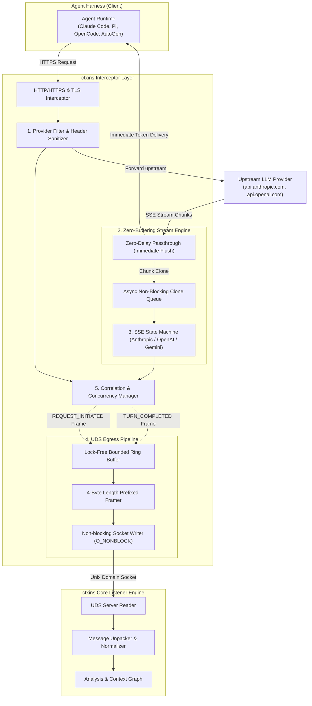
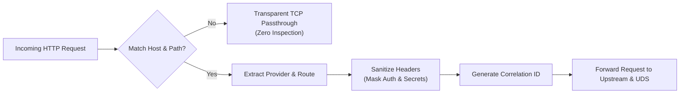
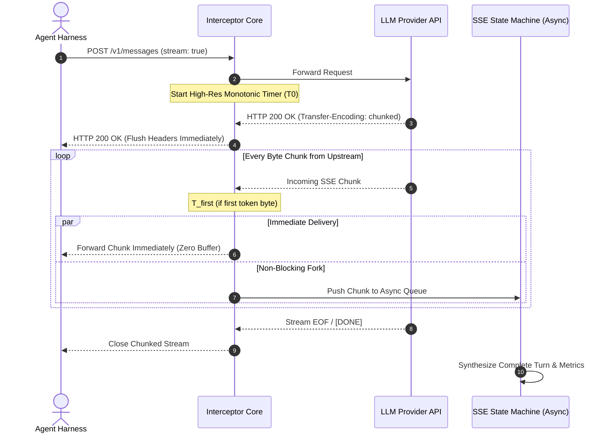
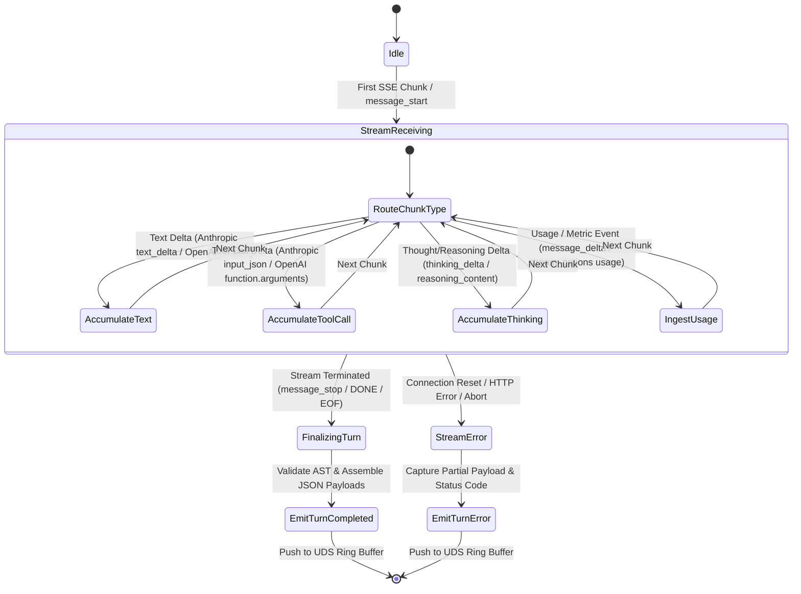
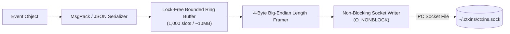
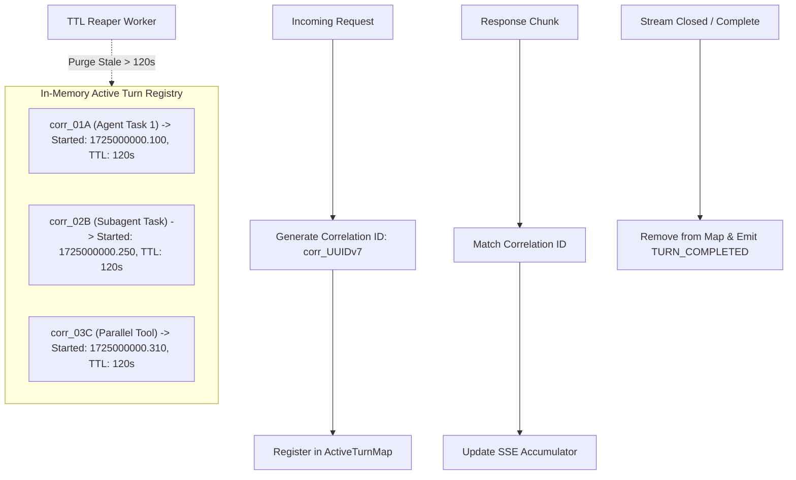

# Design: Interceptor Component & UDS IPC Protocol

## 1. Overview & System Topology

The **Interceptor Component** is a high-performance network tap placed between agentic harnesses (e.g., Claude Code, OpenCode, Pi, AutoGen, custom SDKs) and upstream LLM provider APIs.

Its primary responsibilities are:
1. **Zero-Overhead Interception**: Forwarding HTTP/HTTPS and SSE streaming traffic with **sub-millisecond latency**.
2. **Deterministic Provider Filtering & Sanitization**: Filtering non-LLM traffic, redacting sensitive credentials, and normalizing headers.
3. **SSE Stream State Assembly**: Reconstructing complete LLM response payloads from fragmented streaming events in parallel without blocking client token delivery.
4. **Resilient UDS Shipping**: Streaming structured wire envelopes across a **Unix Domain Socket (UDS)** to the `ctxins` Core Listener using a fail-open, non-blocking architecture.



---

## 2. Component 1: Provider Filter & Header Sanitizer

The `ProviderFilter` acts as the first gatekeeper. It identifies LLM traffic, bypasses noise, and strips sensitive authentication tokens before telemetry leaves memory.



### A. Provider Routing Matrix
The filter inspects the SNI hostname, `Host` header, and request path:

| Provider | Hostname Pattern | API Path Matching | Wire Format |
| :--- | :--- | :--- | :--- |
| **Anthropic** | `api.anthropic.com` | `/v1/messages*` | Anthropic Messages API |
| **OpenAI** | `api.openai.com` | `/v1/chat/completions*`, `/v1/responses*` | OpenAI Chat / Responses API |
| **Google Gemini** | `generativelanguage.googleapis.com` | `/v1beta/models/*:generateContent*`, `/v1beta/models/*:streamGenerateContent*` | Google Gemini REST / SSE |
| **Azure OpenAI** | `*.openai.azure.com` | `/openai/deployments/*/chat/completions*` | Azure OpenAI API |
| **OpenRouter** | `openrouter.ai` | `/api/v1/chat/completions*` | OpenAI Compatible |
| **Ollama** | `localhost:11434`, `127.0.0.1:11434` | `/api/chat*`, `/v1/chat/completions*` | Ollama / OpenAI API |

Requests not matching this matrix are passed through untouched without entering the inspection pipeline.

### B. Header & Secret Sanitization Engine
To ensure GDPR, SOC2, and enterprise security compliance, credentials must never be written to UDS, logs, or session dumps.

#### Sanitization Rules:
1. **Redacted Headers**:
   - `Authorization` $\to$ `[REDACTED]` (or preserve prefix: `Bearer sk-ant-api03-***...`)
   - `x-api-key` $\to$ `[REDACTED]`
   - `api-key` $\to$ `[REDACTED]`
   - `proxy-authorization` $\to$ `[REDACTED]`
   - `cookie`, `set-cookie` $\to$ `[REDACTED]`
2. **Preserved Observability Headers**:
   - `anthropic-version`, `anthropic-beta` (crucial for detecting prompt caching)
   - `openai-organization`, `openai-project`
   - `x-request-id`, `request-id`
   - Rate limit telemetry: `anthropic-ratelimit-*`, `x-ratelimit-*`
3. **Payload Sanitization**:
   If the JSON body contains explicit API keys (e.g. nested proxy configurations), any key matching `/(?i)(api[_-]?key|secret|password|access[_-]?token)/` has its value replaced with `"[REDACTED]"`.

---

## 3. Component 2: Zero-Buffering Streaming Passthrough & Async Tee

Agent harnesses rely on low Time-To-First-Token (TTFT) and continuous token streams to execute tools in real time. The stream engine uses the **Tee-and-Accumulate** pattern to decouple client delivery from telemetry collection.



### High-Resolution Latency Timers
The interceptor captures timestamps using high-resolution monotonic clocks (`clock_gettime(CLOCK_MONOTONIC)`):
* $T_0$: `request_dispatched_at` (when last byte of client request is sent upstream)
* $T_{\text{first}}$: `first_byte_received_at` (when first SSE chunk arrives from upstream)
* $T_{\text{end}}$: `stream_closed_at` (when final chunk/EOF is received)
* **Metrics Calculated**:
  $$\text{TTFT (Time To First Token)} = T_{\text{first}} - T_0$$
  $$\text{Total Generation Latency} = T_{\text{end}} - T_0$$
  $$\text{Streaming Duration} = T_{\text{end}} - T_{\text{first}}$$

---

## 4. Component 3: Provider SSE State Machines & Chunk Accumulator

The asynchronous accumulator ingests raw SSE chunk clones and reconstructs the conversational turn.



### Protocol-Specific Handlers

#### 1. Anthropic SSE State Machine
* **`message_start`**: Captures base message metadata, model ID, and input token counts (`cache_creation_input_tokens`, `cache_read_input_tokens`, `input_tokens`).
* **`content_block_start`**: Initializes a block (e.g. index $i$, type: `"text"` or `"tool_use"` with `tool_id` and `name`).
* **`content_block_delta`**:
  * For text: Appends substring to `content[i].text`.
  * For tool calls: Appends raw partial JSON strings to `content[i].partial_json`.
* **`content_block_stop`**: Finalizes the block; parses `partial_json` into a structured JSON object.
* **`message_delta`**: Extracts `stop_reason` (`"end_turn"`, `"tool_use"`, `"max_tokens"`) and output usage metrics (`output_tokens`).
* **`message_stop`**: Emits `TURN_COMPLETED`.

#### 2. OpenAI SSE State Machine
* **Chunks (`chat.completion.chunk`)**:
  * Tracks `choices[0].delta.content` for regular message text.
  * Tracks `choices[0].delta.tool_calls[j]`:
    * Accumulates partial `function.arguments` strings keyed by tool index $j$.
    * Captures `function.name` and `id`.
  * Captures `choices[0].finish_reason`.
  * Captures trailing `usage` object (if `stream_options.include_usage: true`).
* **`data: [DONE]`**: Assembles final tool arguments JSON and emits `TURN_COMPLETED`.

#### 3. Google Gemini SSE State Machine
* Streams chunks of `GenerateContentResponse`.
* Accumulates `candidates[0].content.parts[]` containing text or `functionCall` objects.
* Extracts `usageMetadata` (`promptTokenCount`, `candidatesTokenCount`, `totalTokenCount`).

---

## 5. Component 4: UDS Egress Pipeline & Framing Protocol

The UDS pipeline safely transmits captured frames from the Interceptor process to the Listener process.



### A. Binary Length-Prefixed Wire Frame
To eliminate delimiter collisions with JSON payloads, all messages are framed with a **4-byte Big-Endian unsigned integer**:

```text
 0                   1                   2                   3
 0 1 2 3 4 5 6 7 8 9 0 1 2 3 4 5 6 7 8 9 0 1 2 3 4 5 6 7 8 9 0 1
+-+-+-+-+-+-+-+-+-+-+-+-+-+-+-+-+-+-+-+-+-+-+-+-+-+-+-+-+-+-+-+-+
|                  Payload Length (uint32_be)                   |
+-+-+-+-+-+-+-+-+-+-+-+-+-+-+-+-+-+-+-+-+-+-+-+-+-+-+-+-+-+-+-+-+
|                                                               |
|                   UTF-8 JSON / MsgPack Payload                |
|                     (Length bytes exactly)                    |
|                                                               |
+-+-+-+-+-+-+-+-+-+-+-+-+-+-+-+-+-+-+-+-+-+-+-+-+-+-+-+-+-+-+-+-+
```

### B. Lock-Free Ring Buffer & Drop Strategy
* **Buffer Size**: Fixed 1,000 frame capacity (memory bounded to ~10MB).
* **Backpressure Policy (Fail-Open)**:
  * If the ring buffer fills (e.g., Core Listener is blocked or stopped):
    1. The oldest unread event is dropped from the ring buffer.
    2. An internal `dropped_frames_count` counter is incremented.
    3. The interceptor continues processing agent traffic normally without blocking.
  * When the socket writer drains successfully, it sends a `SYSTEM_TELEMETRY` frame with the dropped count.

### C. Non-Blocking Socket Writer (`O_NONBLOCK`)
The socket writer runs on a dedicated background thread / event loop:
1. Opens socket `~/.ctxins/ctxins.sock` with `O_NONBLOCK`.
2. Handles `EAGAIN` / `EWOULDBLOCK` by registering the file descriptor with `kqueue` (macOS) or `epoll` (Linux).
3. Reconnection Engine: If the Core Listener restarts or the socket is closed (`ECONNRESET`, `EPIPE`), the writer retries with exponential backoff (50ms $\to$ 100ms $\to$ 500ms $\to$ max 2s).

---

## 6. Component 5: Request Correlation & Concurrency Model

Modern agentic harnesses often execute concurrent tool calls, subagents, or speculative requests over a single proxy connection.



### A. Correlation Key Generation
Each turn is assigned a time-sortable **UUIDv7** or **NanoID**:
`corr_01j7abc1234567890abcdef123`

### B. Request-Response Association
1. Upon `REQUEST_INITIATED`, the interceptor registers the correlation ID, provider, model, and sanitized prompt in an active turn registry.
2. When the corresponding HTTP response stream opens, the same correlation ID is bound to the SSE stream accumulator.
3. Upon stream completion, the accumulator correlates the response text, stop reason, and token usage with the initial request data before pushing the final envelope to the UDS ring buffer.

### C. Active Turn Registry & Orphan Cleanup
* If an agent aborts a request mid-stream (e.g. user hits `Ctrl+C` in Claude Code):
  * The socket disconnect is caught by the proxy.
  * A `TURN_ERROR` event with error type `"CLIENT_ABORTED"` is emitted.
  * The correlation entry is immediately de-allocated.
* A background reaper thread evicts orphaned registry entries exceeding a 120-second TTL to prevent memory leaks.

---

## 7. Wire Event Specifications

### 1. `REQUEST_INITIATED`
```jsonc
{
  "specVersion": "1.0",
  "eventType": "REQUEST_INITIATED",
  "correlationId": "corr_01j7xyz901",
  "sessionId": "sess_default",
  "timestamp": 1725000000.120,
  "provider": "anthropic",
  "endpoint": "https://api.anthropic.com/v1/messages",
  "clientMetadata": {
    "userAgent": "claude-code/1.0.4",
    "clientIp": "127.0.0.1",
    "clientPort": 54321
  },
  "sanitizedHeaders": {
    "anthropic-version": "2023-06-01",
    "anthropic-beta": "prompt-caching-2024-07-25",
    "authorization": "[REDACTED]"
  },
  "requestPayload": {
    "model": "claude-3-5-sonnet-20241022",
    "max_tokens": 8192,
    "stream": true,
    "system": "You are an expert coding assistant...",
    "messages": [
      { "role": "user", "content": "Refactor the database connector" }
    ],
    "tools": [
      { "name": "view_file", "description": "...", "input_schema": { ... } }
    ]
  }
}
```

### 2. `TURN_COMPLETED`
```jsonc
{
  "specVersion": "1.0",
  "eventType": "TURN_COMPLETED",
  "correlationId": "corr_01j7xyz901",
  "timestamp": 1725000002.340,
  "httpStatus": 200,
  "timing": {
    "requestDispatchedMs": 1725000000120,
    "firstByteReceivedMs": 1725000000410, // TTFT = 290ms
    "streamEndedMs": 1725000002340,       // Total = 2220ms
    "durationMs": 2220
  },
  "usage": {
    "inputTokens": 14200,
    "outputTokens": 450,
    "cacheCreationInputTokens": 12000,
    "cacheReadInputTokens": 2200
  },
  "responsePayload": {
    "role": "assistant",
    "stopReason": "tool_use",
    "content": [
      { "type": "text", "text": "Let me inspect db/client.go first." },
      { 
        "type": "tool_use", 
        "id": "toolu_01A", 
        "name": "view_file", 
        "input": { "path": "db/client.go" } 
      }
    ]
  }
}
```

### 3. `TURN_ERROR`
```jsonc
{
  "specVersion": "1.0",
  "eventType": "TURN_ERROR",
  "correlationId": "corr_01j7xyz901",
  "timestamp": 1725000001.050,
  "httpStatus": 429,
  "error": {
    "type": "rate_limit_error",
    "message": "Rate limit exceeded.",
    "retryAfterSeconds": 12
  }
}
```

---

## 8. Summary of Component Guarantees

| Subsystem | Core Mechanism | Design Guarantee |
| :--- | :--- | :--- |
| **Provider Filter** | Host & Path Trie Matcher | Non-LLM traffic bypassed with zero inspection cost. |
| **Header Sanitizer** | Deterministic Regex & Key Scrubbing | Zero credential leakage over UDS or exported artifacts. |
| **Passthrough Engine** | Zero-Buffering Chunk Pipe | Zero degradation to agent TTFT or streaming speed. |
| **SSE Accumulator** | Protocol State Machine | Accurate AST synthesis and token count collection across providers. |
| **UDS Producer** | Lock-Free Ring Buffer + Non-Blocking Socket | Strict fail-open operation; agent traffic is never blocked. |
| **Concurrency Manager**| Correlation Map + TTL Reaper | Safe handling of parallel agent tasks and orphan cleanup. |
