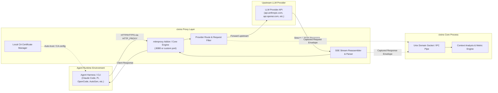

# Design: Network-Level Interception (MITM Proxy)

## 1. Overview

The **Network-Level Interception** approach positions `ctxins` as a transparent HTTP/HTTPS proxy between any agentic harness (or script) and LLM provider APIs (e.g., OpenAI, Anthropic, Google Vertex/Gemini, Ollama, OpenRouter).

This approach provides **100% harness-agnostic, zero-code-change observability** by tapping into the raw wire traffic at the network boundary.



---

## 2. Key Capabilities & Advantages

1. **Zero Harness Instrumentation**:
   Works universally with any tool, SDK, or language runtime (Python, TypeScript, Go, Rust, Ruby, cURL, binary CLIs) simply by setting standard proxy environment variables:
   ```bash
   export HTTP_PROXY="http://127.0.0.1:8080"
   export HTTPS_PROXY="http://127.0.0.1:8080"
   export SSL_CERT_FILE="~/.ctxins/certs/mitmproxy-ca-cert.pem"
   export REQUESTS_CA_BUNDLE="~/.ctxins/certs/mitmproxy-ca-cert.pem"
   export NODE_EXTRA_CA_CERTS="~/.ctxins/certs/mitmproxy-ca-cert.pem"
   ```

2. **Wrapper Execution Mode**:
   `ctxins` can spawn commands directly with proxy variables injected into the child process environment:
   ```bash
   ctxins exec -- claude
   ctxins exec -- npm run dev
   ctxins exec -- python agent.py
   ```

3. **Bit-Level Wire Fidelity**:
   Captures exact raw wire payloads, including:
   - Provider-specific caching headers (e.g. `anthropic-beta: prompt-caching-2024-07-25`).
   - Exact token consumption returned by provider headers and usage payloads.
   - Raw Server-Sent Events (SSE) chunks and chunk arrival latencies.
   - System prompts and tool definitions injected under the hood by proprietary harnesses.

---

## 3. Component Architecture

### A. Provider Traffic Filter & Router
The proxy addon filters all non-LLM network traffic (e.g., telemetry, npm downloads, web search calls) and only intercepts recognized LLM provider endpoints:

| Provider | Host Pattern | Path Pattern |
| :--- | :--- | :--- |
| **Anthropic** | `api.anthropic.com` | `/v1/messages*` |
| **OpenAI** | `api.openai.com` | `/v1/chat/completions*`, `/v1/responses*` |
| **Google Gemini** | `generativelanguage.googleapis.com` | `/v1beta/models/*:generateContent*`, `/v1beta/models/*:streamGenerateContent*` |
| **Azure OpenAI** | `*.openai.azure.com` | `/openai/deployments/*/chat/completions*` |
| **Ollama** | `localhost:11434`, `127.0.0.1:11434` | `/api/chat`, `/v1/chat/completions` |
| **OpenRouter** | `openrouter.ai` | `/api/v1/chat/completions*` |

Traffic matching other domains passes through transparently with zero inspection overhead.

### B. Streaming Response Tap (SSE Stream Parser)
Modern agent harnesses almost exclusively use streaming responses (`stream: true`). The proxy must inspect the stream without buffering or delaying token delivery to the client.

* **Non-blocking Stream Tap**:
  As SSE chunks arrive from the upstream server, chunks are forwarded immediately to the client socket while a streaming state machine simultaneously buffers the delta objects in memory.
* **Stream Aggregation**:
  Once the stream completes (e.g., `data: [DONE]` or stream EOF), the final message content, tool call arguments, finish reason, and token usage blocks are assembled and emitted as a completed turn event.

### C. IPC Bridge to Core Engine
Captured requests and responses are bundled into lightweight JSON-L envelopes and transmitted over a local Unix Domain Socket (`~/.ctxins/ctxins.sock`) or Named Pipe (Windows):

```json
{
  "version": "1.0",
  "source": "mitmproxy",
  "requestId": "req_01j7abc123",
  "timestamp": 1725000000.123,
  "timing": {
    "requestStartMs": 1725000000123,
    "firstTokenMs": 1725000000450,
    "streamEndMs": 1725000002100
  },
  "provider": "anthropic",
  "model": "claude-3-5-sonnet-20241022",
  "request": {
    "headers": { "anthropic-beta": "prompt-caching-2024-07-25" },
    "body": { "messages": [] }
  },
  "response": {
    "statusCode": 200,
    "headers": { "anthropic-ratelimit-tokens-remaining": "50000" },
    "body": { "content": [], "usage": { "input_tokens": 1500, "output_tokens": 120 } }
  }
}
```

---

## 4. Operational Modes

### 1. Embedded Subprocess Mode (Default CLI)
Running `ctxins run -- <command>` starts `mitmproxy` as an embedded background worker, sets up transient certificates, launches the target command with proxy environment variables configured, and opens the interactive TUI. When the harness exits, `ctxins` cleanly shuts down the proxy.

### 2. Standalone Daemon Mode
Running `ctxins proxy --port 8080` operates as a persistent daemon. Multiple concurrent CLI runs or background containers can point their `HTTP_PROXY` to this shared port.

---

## 5. Trade-offs & Mitigations

| Challenge | Impact | Mitigation Strategy |
| :--- | :--- | :--- |
| **CA Certificate Trust** | Runtimes reject untrusted TLS certificates by default. | `ctxins` automates certificate provisioning and passes explicit CA bundle env vars (`SSL_CERT_FILE`, `NODE_EXTRA_CA_CERTS`, `REQUESTS_CA_BUNDLE`). |
| **Proxy Latency** | Intercepting streaming traffic could introduce latency. | Zero-copy chunk forwarding directly to client before parsing internal telemetry. |
| **System-wide Noise** | Browsers or background tasks hitting proxy. | Strict domain-level allowlist filtering out all non-LLM API traffic. |
