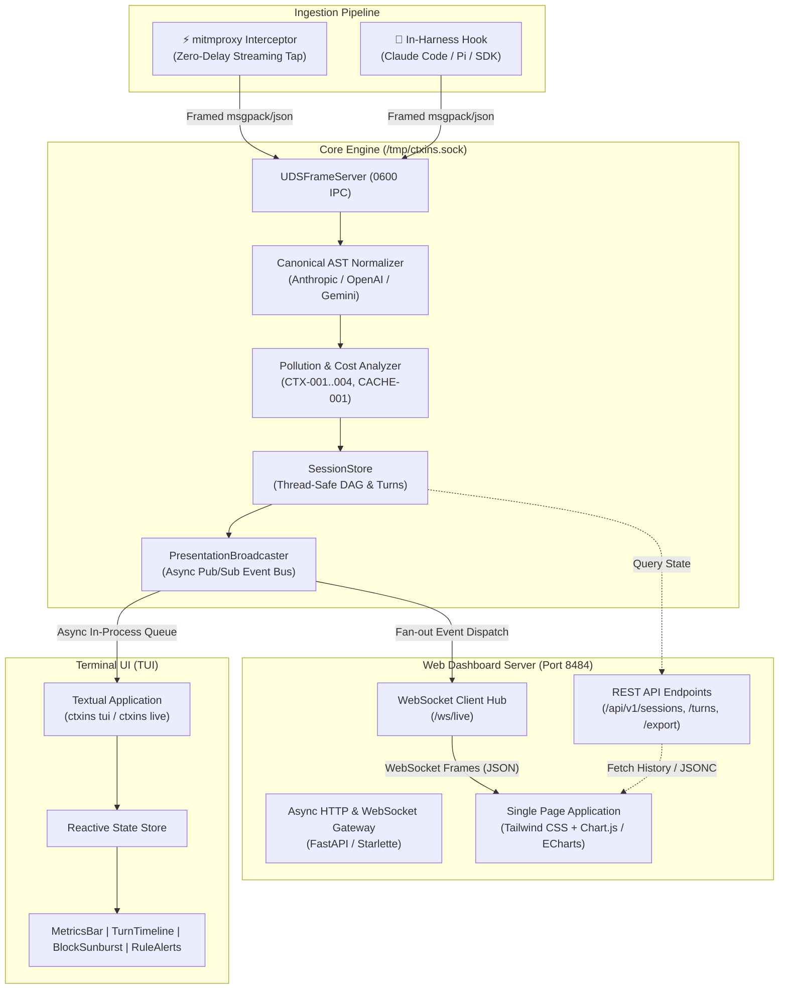

# High-Level Design: Real-Time TUI & Web Dashboard

This document specifies the design, architecture, and user experience for the `ctxins` presentation layer: the **Interactive Terminal UI (TUI)** and the **Web Browser Dashboard**. Both interfaces provide real-time, zero-delay visibility into context composition, token consumption, prompt cache dynamics, and actionable optimization recommendations.

---

## 1. Vision & Objectives

Modern agentic coding harnesses (Antigravity `agy`, Claude Code, Aider, AutoGen, CrewAI) operate as opaque black boxes that accumulate context rapidly. Developers frequently encounter:
- **Invisible Token Bloat**: Giant tool results (e.g. `15,000` tokens from directory scans or build logs) lingering unreferenced for turns.
- **Cache Invalidation Thrashing**: Moving timestamps or random identifiers in system prompts that bust Anthropic/OpenAI prompt caches, quadrupling costs.
- **Runaway Loops**: Agents retrying the same failing tool command across multiple consecutive turns.
- **Schema Overweight**: Dozens of tool definitions loaded into context that the agent never calls.

The `ctxins` UI layer transforms this hidden waste into **real-time visual intelligence and actionable code/prompt optimizations**.

### Core Tenets
1. **Zero Agent Interference**: Telemetry ingestion operates passively via Unix Domain Socket IPC without adding token delivery latency or blocking agent execution.
2. **Real-Time Stream Synchronicity**: As tokens stream into the agent, the UI reflects Time-To-First-Token (TTFT), token accumulation rates, and context composition deltas in real-time.
3. **Prescriptive Recommendations**: Don't just display graphs—highlight specific rule violations (`CTX-001`..`004`, `CACHE-001`), calculate quantified USD waste, and provide copy-paste fixes.
4. **Ergonomic Multi-Modal Access**:
   - **TUI (`ctxins tui` / `ctxins live`)**: In-terminal, keyboard-driven dashboard designed to sit side-by-side with your agent in `tmux` or split windows.
   - **Web Dashboard (`ctxins web` / `http://localhost:8484`)**: Rich, visual dashboard with stacked token charts, interactive context treemaps, and deep-dive diff viewers.

---

## 2. End-to-End System Architecture



---

## 3. Real-Time Telemetry Event Protocol

The Core Engine communicates with presentation frontends through a standardized, typed event bus (`PresentationBroadcaster`).

### Event Stream Contracts

| Event Type | Timing | Payload Description |
| :--- | :--- | :--- |
| `SESSION_CREATED` | First turn arrives for a session | `{ sessionId, timestamp, client, provider, model }` |
| `TURN_STARTED` | Ingress request intercepted | `{ sessionId, turnIndex, correlationId, timestamp }` |
| `TURN_STREAMING` | Active streaming delta (every ~100ms) | `{ sessionId, turnIndex, deltaTokens, currentTTFTMs, thoughts }` |
| `TURN_COMPLETED` | Turn response completed & analyzed | `{ sessionId, turn: CanonicalTurn, delta: TurnDelta, summary: SessionSummary }` |
| `VIOLATION_DETECTED` | Heuristic triggers on turn | `{ sessionId, turnIndex, violation: RuleViolation, compositeScore }` |
| `SESSION_SUMMARY_UPDATED`| Aggregate metrics recalculated | `{ sessionId, summary: SessionSummary, pollutionScore }` |

### JSON Event Schema Example: `TURN_COMPLETED`

```jsonc
{
  "event": "TURN_COMPLETED",
  "sessionId": "sess_01j7abc991",
  "turnIndex": 3,
  "data": {
    "turn": {
      "turnId": "turn_01j7xyz901",
      "correlationId": "corr_01j7xyz901",
      "model": "claude-3-5-sonnet-20241022",
      "provider": "anthropic",
      "timing": { "ttftMs": 310, "durationMs": 2450 },
      "tokens": {
        "system": 1800,
        "tools": 2400,
        "history": 3200,
        "toolResults": 14500,
        "thoughts": 420,
        "output": 350
      },
      "cache": { "readTokens": 62000, "createdTokens": 17700 },
      "cost": { "turnCostUSD": 0.048, "wastedCostUSD": 0.015 },
      "violations": [
        {
          "ruleId": "CTX-001",
          "severity": "WARN",
          "title": "Stale Tool Output Bloat",
          "message": "Tool result 'run_shell' (14,500 tokens) unreferenced for 3 consecutive turns.",
          "estimatedWasteUSD": 0.0435,
          "suggestedFix": "Prune tool outputs older than 2 turns from conversation history.",
          "blockIds": ["blk_tool_res_392"]
        }
      ]
    },
    "summary": {
      "totalTokens": 84200,
      "cacheHitRatio": 0.736,
      "totalCostUSD": 0.284,
      "wastedCostUSD": 0.092,
      "pollutionScore": 14.2
    }
  }
}
```

---

## 4. Interactive Terminal UI (TUI) Design

The TUI is implemented using **Textual**, Python's modern terminal application framework. It runs natively in any standard terminal (macOS Terminal, iTerm2, Alacritty, Kitty, WezTerm, VS Code terminal).

### 4.1 UI Layout & Wireframe

```text
┌─────────────────────────────────────────────────────────────────────────────────────────────────────────┐
│ ctxins v0.1.0 │ Session: sess_01j7abc991 (claude-3-5-sonnet) │ Status: ● STREAMING (Turn #4) │ Q: Quit │
├─────────────────────────────────────────────────────────────────────────────────────────────────────────┤
│ TOTAL TOKENS: 84.2k  │ CACHE HIT: 73.6% (62.0k) │ SPEND: $0.284 │ WASTED: $0.092 │ POLLUTION: 14.2/100  │
├──────────────────────────────┬────────────────────────────────────────────┬─────────────────────────────┤
│ [1] TURNS & TIMELINE         │ [2] CONTEXT COMPOSITION (TURN #3)          │ [3] RECOMMENDATIONS & ALERTS│
├──────────────────────────────┼────────────────────────────────────────────┼─────────────────────────────┤
│ ▶ Turn #1 (init)      12.4k  │ System Prompt:   1,800 tok  [2.1%]   ■■     │ ⚠ CTX-001: Stale Tool Out   │
│   Turn #2 (file read) 24.1k  │ Tool Schemas:    2,400 tok  [2.8%]   ■■■    │   Turn #3: file_search res  │
│   Turn #3 (bash run)  48.2k  │ Conversation:    3,200 tok  [3.8%]   ■■■■   │   unreferenced for 3 turns. │
│ ● Turn #4 (streaming) 84.2k  │ Tool Results:   14,500 tok [17.2%]  ■■■■■■ │   Waste: $0.048 (14.5k tok) │
│                              │ Thinking Block:    420 tok  [0.5%]   ■      │   Fix: Prune old output     │
│                              │ Output Tokens:     350 tok  [0.4%]   ■      │ ─────────────────────────── │
│                              │ Cache Read:     62,000 tok [73.6%]  ■■■■■■ │ 🚨 CACHE-001: Prefix Break  │
│                              ├────────────────────────────────────────────┤   System prompt hash shifted│
│                              │ SELECTED BLOCK: tool_result (id: blk_90fa) │   Waste: $0.044             │
│                              │ Tool: run_shell ("find . -name '*.py'")    │   Fix: Move timestamp to end│
│                              │ Size: 14,500 tokens | Survived: 3 turns    │                             │
├──────────────────────────────┴────────────────────────────────────────────┴─────────────────────────────┤
│ [Tab] Switch Pane  [↑/↓] Navigate Turns  [Enter] Inspect Block  [r] Filter Warnings  [e] Export .jsonc  │
└─────────────────────────────────────────────────────────────────────────────────────────────────────────┘
```

### 4.2 TUI Component Breakdown
1. **Header KPI Ribbon (`HeaderBarWidget`)**:
   - Live session metadata (Session ID, Model, Provider, Connection Status).
   - High-level metric badges: Total Tokens, Cache Hit %, Spend ($), Wasted Spend ($), Pollution Score (0–100 color-graded: Green `<20`, Yellow `20-50`, Red `>50`).
2. **Turn Timeline Navigator (`TurnTimelineWidget`)**:
   - Chronological list of all turns with state indicators:
     - `●` Streaming / In-flight
     - `✓` Completed cleanly
     - `⚠` Completed with warnings/violations
   - Displays turn duration, TTFT latency, and total token footprint.
3. **Context Composition Breakdown (`ContextBreakdownWidget`)**:
   - Visual ASCII bar breakdown of context categories for the highlighted turn.
   - Detail drawer showing selected block attributes (ID, tool name, token count, lineage survival count).
4. **Recommendations & Rule Violations Pane (`RecommendationsWidget`)**:
   - Real-time list of violations filtered by severity (`CRITICAL`, `WARN`, `INFO`).
   - Displays rule ID (`CTX-001`, `CTX-002`, `CTX-003`, `CACHE-001`), financial impact, and exact suggested remediation.
5. **Footer Command Bar (`FooterBarWidget`)**:
   - Contextual keyboard shortcuts (`Tab` pane navigation, `j`/`k` turn scrolling, `Enter` details, `e` JSONC export, `q` quit).

### 4.3 Keybindings & Interactions

| Key | Action |
| :--- | :--- |
| `Tab` / `Shift+Tab` | Cycle focus across panes (Timeline $\rightarrow$ Composition $\rightarrow$ Recommendations) |
| `↑` / `↓` or `k` / `j` | Navigate turns or blocks within the active pane |
| `Enter` | Expand selected turn or block details in modal popup |
| `r` | Toggle filter to show only turns with Rule Violations |
| `c` | Toggle Cache Details overlay (cache boundaries, read vs created tokens) |
| `e` | Export current session timeline to annotated `.jsonc` file |
| `q` / `Ctrl+C` | Gracefully detach / exit TUI |

---

## 5. Web Dashboard Design

The Web Dashboard offers an expansive, browser-based inspection environment (`http://localhost:8484`), ideal for detailed performance audits, multi-turn comparisons, and team demos.

### 5.1 Architecture & Tech Stack
- **Server Backend**: Built on `FastAPI` / `Starlette` with `uvicorn` as the ASGI runner. Uses async WebSockets to push live updates.
- **Frontend Architecture**: Embedded Single Page Application (SPA).
  - Designed for **zero-dependency deployment** (all JS/CSS static assets bundled within `src/presentation/web/static/` or served from modern verified CDNs).
  - Responsive layout built with **Tailwind CSS**.
  - Interactive charts powered by **Chart.js** or **Apache ECharts** (for stacked token composition, latency scatter plots, and treemaps).
  - Iconography powered by **Lucide Icons**.

### 5.2 Web Dashboard UI Wireframe

```text
+----------------------------------------------------------------------------------------------------+
|  ctxins  |  Session: sess_01j7abc991  |  Model: claude-3-5-sonnet  |  [Live ●]       [Export JSONC] |
+----------------------------------------------------------------------------------------------------+
|                                                                                                    |
|  [ TOTAL TOKENS ]        [ CACHE HIT RATIO ]      [ TOTAL SPEND ]      [ POLLUTION SCORE ]         |
|     84,200 tok                 73.6%                  $0.284                 14.2 / 100            |
|   +18.4k this turn       62.0k tokens read       $0.092 avoidable         Good (Pristine)          |
|                                                                                                    |
+----------------------------------------------------------------------------------------------------+
| 📈 TOKEN COMPOSITION ACROSS TURNS                              | 🚨 LIVE RECOMMENDATIONS           |
|                                                                |                                   |
| 100k ┤                                                         | ⚠️ CTX-001: Stale Tool Output     |
|      │                                           [Tool Results]|   Turn #3 • 14,500 tokens         |
|  75k ┤                                     ┌───┐               |   Estimated Waste: $0.0435        |
|      │                               ┌───┐ │   │ [Conversation]|   Prune tool results >2 turns old.|
|  50k ┤                         ┌───┐ │   │ │   │               |   [Copy Fix]  [Inspect Block]     |
|      │                   ┌───┐ │   │ │   │ │   │ [Tool Schemas]| ───────────────────────────────── |
|  25k ┤             ┌───┐ │   │ │   │ │   │ │   │               | 🚨 CACHE-001: Prefix Invalidation |
|      │       ┌───┐ │   │ │   │ │   │ │   │ │   │ [System]      |   Turn #1 • Dynamic Prefix Shift  |
|   0k ┴───────┴───┴─┴───┴─┴───┴─┴───┴─┴───┴─┴───┴───────────────|   Estimated Waste: $0.0440        |
|             T1    T2    T3    T4    T5    T6                   |   Move timestamp to prompt end.   |
|                                                                |   [Copy Fix]  [Inspect Block]     |
+----------------------------------------------------------------+-----------------------------------+
| 🔍 TURN INSPECTOR: Turn #3 (2,450ms, TTFT: 310ms)                                                 |
|                                                                                                    |
| [Overview]  [Context Blocks Tree]  [Diff from Turn #2]  [Raw Messages]                            |
|                                                                                                    |
| Block ID      | Type         | Tokens | Survived | Hash      | Actions                             |
| ──────────────┼──────────────┼────────┼──────────┼───────────┼──────────────────────────────────── |
| blk_sys_01    | system       | 1,800  | 3 turns  | 8f9a2b... | [View] [Diff]                       |
| blk_tools_01  | tool_def     | 2,400  | 3 turns  | 1a4d9e... | [View]                              |
| blk_hist_01   | user_msg     |   450  | 2 turns  | c3d881... | [View]                              |
| blk_res_03    | tool_result  | 14,500 | 1 turn   | 90fa41... | [View] [Flagged CTX-001 ⚠️]         |
+----------------------------------------------------------------------------------------------------+
```

### 5.3 Key Interactive Capabilities
1. **Live Context Sunburst / Treemap**:
   - Visual area-proportional representation of the current context window.
   - Easily spot when a single file read (`view_file` on a lockfile or generated binary) dominates 75% of the total prompt tokens.
2. **Prompt Cache Boundary Inspector**:
   - Visualizes exact byte and token offsets where provider prompt caching checkpoints are placed.
   - Highlights in red any prefix alterations that broke cache reuse.
3. **Turn-to-Turn Context Diffing**:
   - Side-by-side AST block diff showing which blocks were newly injected, persisted unchanged, or pruned between sequential turns.
4. **Actionable Fix Generator**:
   - Clickable button to generate harness-specific configuration snippets (e.g. Claude Code `.clauderc` or Aider `.aider.conf.yml` rules to ignore large files, or code to move timestamps).
5. **One-Click Session Export**:
   - Download the full `.jsonc` session trace adhering to `https://ctxins.dev/schemas/session.v1.json`.

---

## 6. Real-Time Synchronization & Performance Guardrails

### 6.1 Low Latency & High Frame Rates
- **Debounced UI Rendering**: Streaming deltas from the interceptor can arrive at 20–50 chunks per second. The `PresentationBroadcaster` batches streaming updates at 50ms intervals (`20 FPS`) to avoid choking the terminal or browser DOM.
- **WebSocket Reconnection**: The web dashboard incorporates exponential backoff auto-reconnect logic (`1s` to `5s`) with automatic state hydration from `/api/v1/sessions/{id}` upon reconnection.

### 6.2 Fail-Safe Decoupling
- The presentation layer runs asynchronously decoupled from the Core Engine's UDS receiver. Slow WebSocket clients or heavy UI rendering **never backpressure the UDS socket** or drop incoming agent frames.
- If a client connection blocks, the broadcaster drops presentation frames for that client while preserving in-memory store integrity.

---

## 7. CLI Execution Modes

`ctxins` provides intuitive CLI modes to launch the appropriate interface:

```bash
# 1. Interactive TUI with embedded proxy and harness
ctxins run --tui -- claude
ctxins run --tui -- agy

# 2. Web Dashboard with embedded proxy and harness
ctxins run --web --port 8484 -- claude

# 3. Standalone TUI attached to running Core Engine
ctxins tui --socket /tmp/ctxins.sock

# 4. Standalone Web Dashboard attached to running Core Engine
ctxins web --port 8484 --socket /tmp/ctxins.sock

# 5. Headless daemon mode with Web Dashboard enabled
ctxins live --web --port 8484
```
