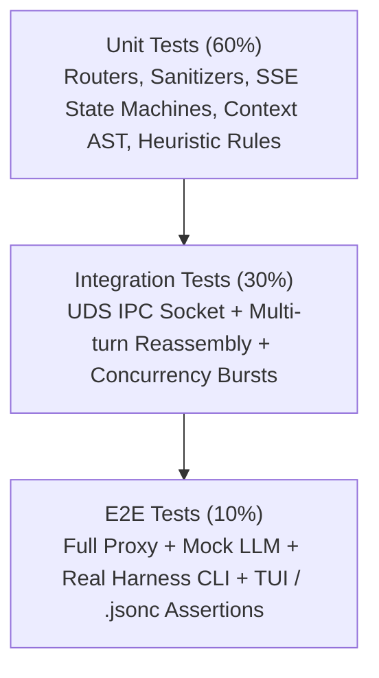
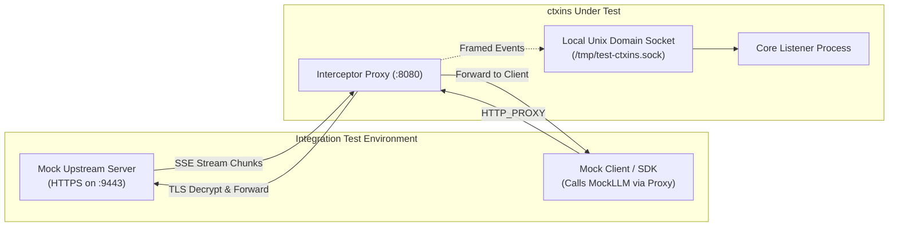
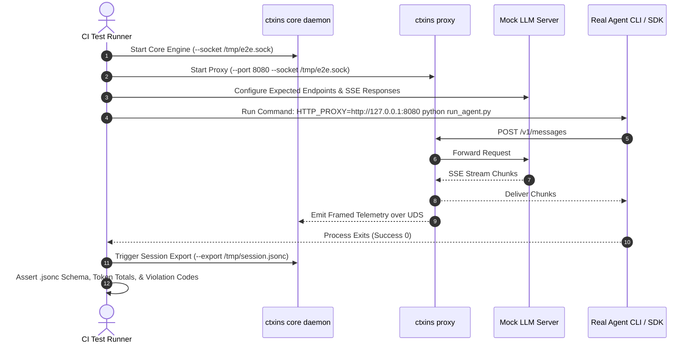
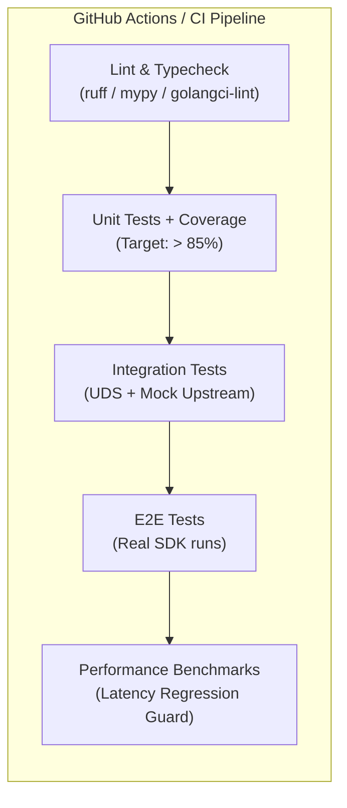

# Comprehensive Test Strategy: ctxins

## 1. Overview & Test Pyramid

Testing `ctxins` requires verifying high-throughput network interception, real-time SSE stream reassembly, IPC transmission resilience, and deterministic context analytics without impacting agent execution speed.



---

## 2. Test Strategy Matrix

| Test Level | Target Component | Key Verification Objective | Tools & Frameworks |
| :--- | :--- | :--- | :--- |
| **Unit** | `ProviderRouter` | Correct matching of hostnames & paths; rejection of non-LLM traffic. | `pytest` / Go `testing` |
| **Unit** | `HeaderSanitizer` | Redaction of API keys; retention of diagnostic & caching headers. | `pytest` / Go `testing` |
| **Unit** | `SSEAccumulator` | Split-chunk handling, tool JSON reconstruction, usage extraction. | Golden SSE test fixtures |
| **Unit** | `BoundedRingBuffer` | Capacity enforcement, drop telemetry, thread safety. | Concurrency stress tests |
| **Unit** | `TurnNormalizer` | Deterministic AST generation across Anthropic, OpenAI, and Gemini. | Mock payload fixtures |
| **Unit** | `PollutionAnalyzer` | Correct firing of `CTX-001` through `CTX-005` and `CACHE-001`. | Synthetic turn lineages |
| **Integration** | `UDSClient` $\leftrightarrow$ `UDSFrameServer` | 4-byte length framing, socket disconnect/reconnect, fail-open buffers. | Real Unix domain sockets |
| **Integration** | Proxy Pipeline | Zero-buffering chunk passthrough to client + background accumulator. | Mock upstream HTTP/2 server |
| **E2E** | Full System | Spawn proxy, run real SDK/CLI client, verify exported `.jsonc` session. | Subprocess runner + WireMock |
| **Performance** | Network Tap | Measure TTFT degradation and memory usage under 1,000 req/min. | Benchmark harness (Locust / k6) |

---

## 3. Unit Testing Specifications

### A. Interceptor Unit Tests

#### 1. Provider Routing & Sanitization
* **Host & Path Edge Cases**:
  * Verify `api.anthropic.com/v1/messages` matches `Provider.ANTHROPIC`.
  * Verify `api.openai.com/v1/chat/completions` matches `Provider.OPENAI`.
  * Verify non-LLM domains (`github.com`, `registry.npmjs.org`, `telemetry.anthropic.com`) return `(False, UNKNOWN)`.
* **Credential Redaction**:
  * Headers: `Authorization: Bearer sk-123...`, `x-api-key: secret`, `Cookie` must be sanitized to `[REDACTED]`.
  * Preserved: `anthropic-beta`, `anthropic-version`, `openai-organization`, `x-request-id`.
  * Payloads: Nested JSON keys matching `*api_key*` or `*token*` masked.

#### 2. SSE State Machine & Chunk Accumulator (`test_accumulators`)
* **Fragmented Chunk Boundaries**:
  * Feeds chunks split across arbitrary byte boundaries:
    ```text
    Chunk 1: "event: content_block_delta\ndat"
    Chunk 2: "a: {\"type\":\"text_delta\",\"text\":\"Hello"
    Chunk 3: " world\"}\n\n"
    ```
  * Asserts accumulated text equals `"Hello world"`.
* **Tool Call Argument Stitching**:
  * Feeds 5 sequential `input_json_delta` chunks.
  * Asserts final payload parses into valid dictionary `{"query": "SELECT * FROM users"}`.
* **Usage & Stop Reasons**:
  * Asserts `message_delta` extracts `output_tokens: 150` and `stop_reason: "tool_use"`.

#### 3. Bounded Ring Buffer & Framing (`test_ring_buffer`)
* **Capacity Limit**: Enqueue 1,005 items into a buffer sized for 1,000. Assert size remains 1,000 and `dropped_count == 5`.
* **Framing Serialization**: Verify `struct.pack(">I", len(data))` produces correct big-endian lengths for small (10B), medium (1KB), and large (500KB) payloads.

---

### B. Core Engine Unit Tests

#### 1. Canonical AST Normalizer (`test_normalizers`)
* **Decomposition Accuracy**: Verify raw JSON maps accurately to `SystemPromptBlock`, `ToolDefinitionBlock`, `MessageBlock`, and `ToolResultBlock`.
* **Content Hashing**: Ensure two blocks with identical text produce identical SHA-256 hashes.

#### 2. Heuristics & Pollution Engine (`test_heuristics`)
* **`CTX-001` (Stale Tool Output)**:
  * Fixture: Turn 0 has a 4,000-token tool result. Turns 1, 2, and 3 repeat the context without referencing the tool ID in assistant replies.
  * Expected: `RuleViolation` flagged at Turn 3 with severity `WARN`.
* **`CTX-002` (Tool Schema Overweight)**:
  * Fixture: 20 tools consuming 5,000 tokens (50% of input). Only 1 tool is invoked over 5 turns.
  * Expected: `RuleViolation` flagged with severity `WARN`.
* **`CTX-003` (Error Loop)**:
  * Fixture: 3 consecutive turns containing tool results with `is_error: True` and similar error text.
  * Expected: `RuleViolation` flagged with severity `CRITICAL`.
* **`CACHE-001` (Dynamic Prefix Invalidation)**:
  * Fixture: Turn 1 has `System: Instructions`. Turn 2 has `System: [Time: 12:00:01] Instructions`.
  * Expected: `CACHE-001` flagged with estimated monetary loss.

---

## 4. Integration Testing Specifications



### Key Integration Test Scenarios:

1. **UDS Transport Resilience & Reconnection**:
   * Start `UDSClient` before the `UDSFrameServer` is active. Assert client does not crash and buffers frames in memory.
   * Start `UDSFrameServer`. Assert client connects and drains queued frames.
   * Kill `UDSFrameServer` abruptly (`SIGKILL`). Push 50 frames. Restart server. Assert client reconnects with zero frame corruption.
2. **Streaming Chunk Passthrough Latency**:
   * Feed a 1,000-token streaming response from `MockLLM`.
   * Measure the timestamp difference between chunk emission from mock server and chunk receipt at client.
   * Assert added interception latency is $< 1.5\text{ ms}$ per chunk.
3. **Multi-Turn Conversation Flow**:
   * Client makes 3 conversational turns against `MockLLM`.
   * Assert the Core Engine constructs a session containing 3 linked `CanonicalTurn` objects in sequential order with matching `correlationId`s.

---

## 5. End-to-End (E2E) Testing Specifications

E2E tests execute the complete system binary in a container or local subprocess environment.



### E2E Test Cases:
* **Test E2E-1: Claude Code Mock Workflow**:
  * Agent CLI executes a mock multi-turn coding task involving file reads and error fixes.
  * Verification: Assert output `.jsonc` contains accurate turns, tool call records, token counts matching provider headers, and calculated pollution scores.
* **Test E2E-2: Baseline Diff & Regression (`ctxins diff`)**:
  * Run `ctxins diff baseline.jsonc polluted.jsonc`.
  * Verification: Assert CLI returns exit code `1` (regression detected), shows expected delta tables, and flags `CTX-001`.

---

## 6. Performance & Benchmark Testing

| Benchmark Target | Metric | Threshold / Target | Test Method |
| :--- | :--- | :--- | :--- |
| **Proxy Latency Overhead** | Added latency on TTFT | $\le 2.0\text{ ms}$ | 500 concurrent connections via `k6` comparing direct vs proxied latency. |
| **Inter-Token Jitter** | Chunk delivery delay | $\le 0.5\text{ ms}$ | High-resolution timestamping on client socket reads. |
| **Memory Footprint** | Resident Set Size (RSS) | $\le 50\text{ MB}$ | Run continuous 100-turn agent session under memory profiling. |
| **CPU Usage** | CPU utilization during stream | $\le 5\%$ of 1 core | Ingestion throughput at 100 tokens/second. |

---

## 7. CI/CD Automated Test Pipeline


